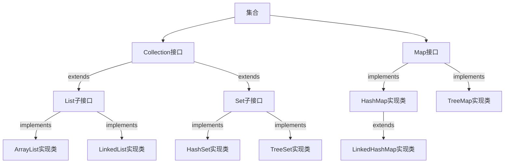
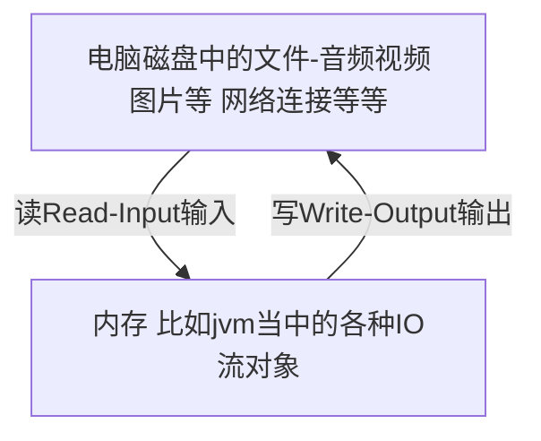
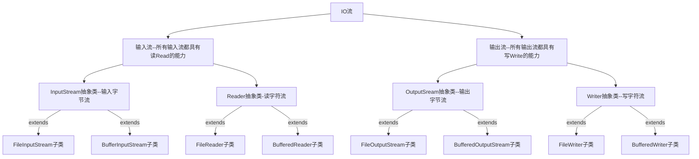
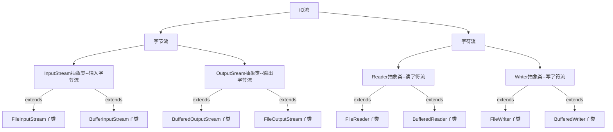
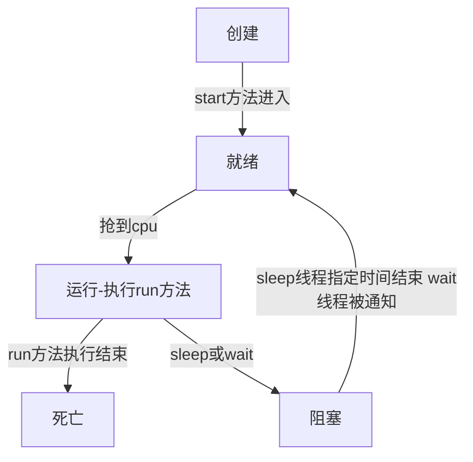

# java笔记

## 一、java基础

### 1.1 java关键词和标识符

```java
关键字：一般是编译器高亮显示的的都是java当中的关键字，这些关键字都是程序员开发者不能修改的东西，比如public，class，static,package,是sun公司规定的。
```

```java
标识符：
	是程序员开发者能自己命名的单词，比如类名，方法名，变量名
    public class Hello {
        public static void main(String[] args) {
            System.out.println("Hello World");
        }
        //其中的Hello，main就是标识符
    }
	
1.标识符在使用的时候要遵守规则和规范
    a.规则：字母、数字、下划线、美元符号，不能以数字开头
    规则就是法律，语法，必须遵守，不遵守java语法编译就不通过
    b.规范：可以不遵守，但最好都要遵守，不遵守也能通过
    	i:见名知意
        ii:驼峰命名，有高有低，高低指的是英文大小写
            类名：不能用中文，用英文单词首字母大写，比如UserLogin
            方法名：首字母小写，其他大写，比如userLogin
            变量名：
            	常量：每个单字全大写，单词之间下划线分开，比如:COMPUTER_BRAND
            	变量：首字母小写，其他大写，比如computerSize
    
```

### 1.2字面值

```java
字面值：Java中的数据,Java的组成部分，跟关键字，标识符一样
    10、100、-200 整数
    1.2、-1.2 浮点数
    true、false 布尔值
    'A'、'B'、'我' 字符
    "LiMing" 字符串
    
```

### 1.3基本数据类型

```java
常识
    byte kb mb gb tb
    1kb = 1024b
    1mb = 1024kb
    1gb = 1024mb
    1tb = 1024gb
计算机都是交流电的形式运行的，他只识别0、1电信号
Java当中的数据类型：
    整数型：
        byte
        short
        int
        long
    浮点型（一般用来表小数）：
    	float
    	double
    字符型：
    	char
    布尔型：
    	booblean
    
    
    进制：
    	二进制 0001
    	八进制 1 2 3 4 
    	十进制 012
    	十六进制 0xF
```


| 数据类型 | 占用字节数(1字节=8bit) |
| :------: | :--------------------: |
|   byte   |           1            |
|  short   |           2            |
|   int    |           4            |
|   long   |           8            |
|  float   |           4            |
|  double  |           8            |
| booblean |           1            |
|   char   |           2            |

```
1.在Java当中，定义的整数字面值默认是int类型，平常使用时不要太过纠结它的大小，一般用默认的int类型定义整数就可以了。
2.用小范围的数接受大范围的数时，需要进行强制类型转换，但是转换之后的数据会不精确，也就是精度丢失，强制类型转换时慎重加慎重。
3.在Java当中定义浮点字面值时默认是double类型
4.默认值：一切向0看齐
	整数：0
	浮点数：0.0
	布尔型：false
```

### 1.4 字符

```Java
编码：计算机协会规定标准用来作为计算机和文字之间的一套字典参照表，文字和数字之间的转换表
    因为计算机只认0,1；单纯的文字计算机解释不了。
解码：计算机按照规定格式的字典参照表（编码格式），将存储到计算机内存当中的编码后的二进制文字再解释出来

编码-解码要按照同一样的标准，不一致时会出现乱码问题。
    常见的编码格式ASCLL码，GBK，Unicode（utf-8）
    以后开发当中经常用到的编码是utf-8。

如何定义一个字符：
    语法：char 变量名 = 字面值;
		字面值是用单引号括起来的单个字符，字符只能是单个字符，转义字符是一种特殊字符
        如：char char1 = 'A';
		   char char2 = '我';
		   char char3 = '\u0001';
	转义字符：有一些特殊的字符无法用我们认识的文字表示出来，就规定了一些可以将常见的文字、字符进行转义表示出来。
        如：
        	\n，不加\时是普通的n字符，加了就是回车或换行
        	\t，不加\时是普通的t字符，加了就是制表符或tab键
        
```

### 1.5算术运算符

加、减、乘、除（取商）、自增、自减

注意：核心店自增和自减

自增：++前后都可以放变量

​			变量在前：先用后增1

​			变量在后：先增1再用

自减：--前后都可以放变量

​			变量在前：先用后减1

​			变量在后：先减1再用

```java
public class Test02 {
	public static void main(String[] args) {
		int a = 10, b = 3;
		System.out.println(a + b);
		System.out.println(a - b);
		System.out.println(a * b);
		System.out.println(a / b);
		System.out.println(a % b);
		System.out.println("=================");
		int c = 1;
		System.out.println(c++);
		System.out.println(++c);
		System.out.println("=================");
		int d = 1;
		int f = d++;
		/*
		 * 第一件事：先把d的值给f
		 * 第二件事：d自增，d本身加1，这时候d=d+1=2
		 * */
		System.out.println(f);
		f = ++d;
		System.out.println(f);

	}
}
```

### 1.6 赋值运算符

=（赋值）

+=（加等于）

-=（减等于）

*=（乘等于）

/=（除等于）

%=（模等于）

注意：

1. 做这些运算的时候可能会出现精度丢失的问题，需谨慎。而且编译器不会报错的，能解决的方法就是多自测。
2. 会存在类型转换的问题，不要想当然的认为a+=b就是a=a+b，具体以下为例：

```java
public class Test03 {
	public static void main(String[] args) {
		int a = 10, b = 2;
		a += b;
		System.out.println(a);
		System.out.println(b);
		a -= b;
		System.out.println(a);
		System.out.println(b);
		a *= b;
		System.out.println(a);
		System.out.println(b);
		a /= b;
		System.out.println(a);
		System.out.println(b);
		a %= b;
		System.out.println(a);
		System.out.println(b);
		System.out.println("==========");
		byte c = 126;
		int d = 2;
		c += d;
		//运算的时候可能会出现精度丢失的问题
		//编译器是检查不出来的，所以以后编程需谨慎，多自测
		System.out.println(c);
		System.out.println("==========");
		long f = 100;
		int g = 200;
		f += g;
		System.out.println(f);
		//无论是+=还是-=等赋值运算都会存在自动类型转换

	}
}
```

### 1.7关系运算符

表达式：变量和符号组成的一条式子，它的结果是一个值：

<、 >、 <=、 >= 、 ==、  !=

表达式和表达式之间可以串联使用

```java
public class Test04 {
	public static void main(String[] args) {
		System.out.println(4 == 3);
		System.out.println(4 != 3);
		System.out.println(4 > 3);
		System.out.println(4 < 3);
		System.out.println(4 >= 3);
		System.out.println(4 <= 3);
		boolean a = 4 > 3;
		boolean b = 5 < 2;
		System.out.println(a==b);
	}
}
```


### 1.8逻辑运算符

```java
什么是短路：
(不是不需要)    在程序当中正常的执行顺序被某个运算符切断，一条语句后面的程序就不执行了，类似于生活中的短路现象，
```

常用的逻辑运算符：||（短路或） 、&&（短路或）、 ！（非）

```java
public class Test01 {
	public static void main(String[] args) {
		int a = 1;
		//&&短路与
		//true && true 为 true
		//true && false 为 false
		//false && true 为 false
		//false && false 为 false
		System.out.println((4>3)&&(5<2));
		System.out.println((4<2)&&(5>a++));
		//短路后后续不进行
		//||短路或
		//true || true 为 true
		//true || false 为true
		//false || true 为true
		//false || false 为 false
		System.out.println((2>1)||(4<5));
		int b =2;
		System.out.println((5>3)||(6<b++));
	}
}
```

### 1.9三元运算符

语法：

​			条件表达式？表达式1：表达式2；

注意：

​			1. 三元运算，结果是一个值，不能作为一条独立语句

​			2.后面两个表达式的数值类型要统一，不然编译出错，当然自动类型转换的时候没问题

```java
public class Test02 {
	public static void main(String[] args) {
		int a = 30;
		int b = 30;
		a = (b == 20 ? 2000 : 3000);
		System.out.println(a);
		//a =  (b == 20 ? 2000 : 11.2);
        //编译器a的类型模糊，不确定是整形还是浮点型，报错
		System.out.println(a);
	}
}
```


### 2.0 运算符的优先级

​			没有必要刻意去记忆优先级，最简单的方式是添加括号（）

### 2.1程序流程控制

#### 2.1.1 条件选择结构if

三种用法

```java
//第一种用法
if(布尔表达式){
	语句体;
}
```

```java
//第二种用法
if(布尔表达式1){
    语句体1;
}else{
    语句体2;
}
```

```java
//第三种用法
if(布尔表达式1){
    语句体1;
}else if(布尔表达式2){
    语句体2;
}...else{
    语句体...;
}
```

注意：

1. <kbd>if</kbd> <kbd>else</kbd> <kbd>else if</kbd> 可以相互结合嵌套使用

2. 在第三种方式里面elseif是除了if或者elseif的其他情况，有些条件不要写重了

3. 花括号内括起来的是代码块，<kbd>{}</kbd>不需要分号结尾，只有语句才需要分号结尾


```java
public class Test03 {
	public static void main(String[] args) {
		int x = 0;
		// if第一种用法
		if (x != 1) {
			System.out.println(x);
		}
		// if第二种用法
		int age = 20;
		if (age > 18) {
			System.out.println("成年");
		} else {
			System.out.println("未成年");
		}
		// if第三种用法
		int scroe = 100;
		if (scroe > 90) {
			System.out.println("优");
		} else if (scroe > 70) {
			System.out.println("良");
		} else {
			System.out.println("不及格");
		}
	}
}
```

#### 2.1.2 switch语句

swithch开关的意思

语法：

```java
switch(表达式){
    case 常量值:
        语句体;
        break;//可加可不加，但是要慎重
    case 常量值:
        语句体;
        break;
    ...
    default:
    	语句体:
        break;
}
```

注意：switch在用的时候只需要知道什么时候打开，什么时候结束就行。

​			当switch表达式与case常量值匹配的时候，开关打开，依次执行去寻找break，遇到break结束；找不到的话，知道switch的结尾

​			break一般用来结束switch和循环的

```java
public class Test04 {
	public static void main(String[] args) {
		int weekNum = 0;
		switch (weekNum) {
		case 0:
			System.out.println("一");
			break;
		case 1:
			System.out.println("二");
			break;
		case 2:
			System.out.println("三");
			break;
		case 3:
			System.out.println("四");
			break;
		case 4:
			System.out.println("五");
		case 5:
			System.out.println("六");
			break;
		case 6:
			System.out.println("七");
			break;
		default:
			System.out.println("err");
			break;
		}
	}
}
```

### 2.1.3 补充

```java
public class Test05 {
	public static void main(String[] args) {
		Scanner scanner = new Scanner(System.in);
		int a = scanner.nextInt();
        System.out.println(a);
	}
}
```

关于导包，比如：

```java
import java.util.Scanner;
```

Scanner是别人写好的类，我们可以直接拿来用，但是，前提条件：

1. 项目必须有相关的Jar包
2. 要通过`import`导入，其中上边java util都是文件夹，Scanner是类

​		要注意：不同文件夹下可能有同名的类，不要导错了

​		`java.util.Scanner` 这个整体叫全限定类名

#### 2.1.4.1 循环结构

注意写循环一定不要写死循环，比如果 for(;;){}、(whie(true))、(dowhie(true))

##### 2.1.4.1 for循环

```java
for(初始条件表达式：是否循环表达式，步幅表达式){
    要循环的语句；
}
```
注意：
    三个表达式可以不写
    初始表达式定义的变量，只能在for循环里使用，如果想在for循环外使用，该变量需要把变量定义到外面


执行顺序：
1.初始表达式
2.是否循环
3.是否2为真，运行循环体，执行5
4.如若为假，结束
5.变量进行增量或删减，执行第二步

```java
public class Test01 {
	public static void main(String[] args) {
		for (int i = 0; i < 100; i++) {
			System.out.println(i);

		}
	}
}
```

增量表达式位置较为灵活，也可以在里面

##### 2.1.4.2 while循环（不常用）

```java
while(循环条件){
    循环语句
}
```
`先判断后执行`

##### 2.1.4.3 do...while循环（不常用）

```java
do{
    循环语句
}while(循环条件);
```
`先执行后判断`

```java
public class Test03 {
	public static void main(String[] args) {
		int i = 1;
		while (i <= 100) {
			if (i % 3 == 0) {
				System.out.println(i);
			}
			i++;
		}
		System.out.println("============");
		int j = 1;
		do {
			if (j % 2 == 0) {
				System.out.println(j);
			}
			;
			j++;
		} while (j <= 100);
	}
}

```

##### 2.1.4.3 break 中断/终止

```java
break; 
	可以是一条独立的语句
    可以用在switch和循环中
        用在switch是控制开关
        用在循环是结束当前（最近的）循环，在嵌套循环中不意味整个程序终止。
```

```java
public class Test04 {
	public static void main(String[] args) {
		int count = 0;
		for (int i = 256; i <= 1688; i++) {
			if (i % 13 == 0) {
				System.out.println(i);
				count++;
			}
			if (count == 2) {
				i = 1689;
//				break;
			}
		}
	}
}
```

##### 2.1.4.4 continue 跳过/继续下一条

```java
continue;
	跳出当前循环（离他最近的循环）,继续下一次循环
```

### 2.2数组

定义：用来存储多个相同数据的数据模型（相同、多个）

声明方式：

```java
///第一种
数据类型[] 数组名 = {};
int[] DepAges = {20,18,20,19};
//花括号{}里存放的对应数据类型
//第二种
数据类型[] 数组名 = new 数据类型[数组长度];
int[] DepAges = new int[4];
//定义了年龄为33个长度为4的整数数组
```

数组的声明、存值、取值、遍历

```java
/*
 * 第一种数组存取方式(静态初始化)
 */
public class Test02 {
	public static void main(String[] args) {
		//声明
		int[] ages = {10,20,30};
		//取值，取出第三个位置的数
		//数组变量名加下标：ages[3]
		System.out.println(ages[2]);
		//数组越界，取值时下标不能超出数组长度范围；
	}
}
```

```java

//第二种数组声明方式(动态初始化)
public class Test03 {
	public static void main(String[] args) {
		//33代表着age数组的数据个数(数组长度)
		//这种方式也存值，不同数据类型不同默认值
		//整形默认0；浮点型默认0.0；布尔型默认false
		//引用数据类型:null
		int[] age = new int[33];
	
		//重新赋值，存值
		age[0] =1;
		for (int i = 0; i < age.length; i++) {
			age[i]=i;
		}
		for (int i = 0; i < age.length; i++) {
			System.out.println(age[i]);
		}
		//获取数组长度
		//数组变量名.length,length不是最大下标,就是数组数据个数
		int[] high = {1,2,3,4,5,6,7,8,9,10};
		for (int i : high) {
			System.out.println(i);
		}
		
	}
}
```

### 2.3 JVM内存模型


程序计数器：主要是控制线程当中程序的执行性顺序的；

虚拟机栈：我们平常接触到的最多的就是局部变量，局部变量定义的时候必须要给初始值，这是JVM规定的；

堆：存放对象和数组

元数据：常量池（比如字符串常量）、方法元信息、类元信息

### 2.4 字符串

声明：

```java
第一种：(字符串常量)
    String 字符串变量名 = "字面值";
第二种：(字符串对象)
    String 字符串变量名 = new String("字符串字面值");
```

```java
public class Test01 {
	/*
	 * 创建字符串
	 */
	public static void main(String[] args) {
		// 第一种，创建字符串常量
		String s1 = "Hello World";
		String s2 = "H";
		String s3 = "奥利给";
		String s4 = "";
		String s5 = " ";
		String s6 = "China中国";
		//第二种，创建字符串对象
		String s7 = new String("乌克兰");
		String s8 = new String("China");
	}
}
```

#### 2.4.1 字符串拼接：

用""+"

1.在java中有两种运算方式：

​	加法运算

​	字符串拼接运算

2.在字符串拼接时，表达式中如果出现了多个+号，而且在没有小括号的前提下遵循从左到右依次运算，如果+左右是数字做加法运算，如果+左右至少有一个字符串就做拼接运算。

```java
//字符串拼接
//将多个字符串拼接成一个
public class Test02 {
	public static void main(String[] args) {
		String s1 = "hello";
		String s2 = "world";
		String s3 = s1 + s2;// helloworld
		String s4 = s1 + 10;// hello10
		String s5 = s1 + 10 + 20;// hello1020
		String s6 = 10 + 20 + s1;// 30hello
		String s7 = 10 + (20 + s1);// 1020hello
		System.out.println(s7);
	}
}
```

#### 2.4.2 字符串比较的两种方式

```java
//字符串比较
//1.==比较的是字地址
//2.equals比较的是字面值
public class Test03 {
	public static void main(String[] args) {
		String s1 = "hello";
		String s2 = "world";
		String s3 = s1;
		String s4 = "hello";
		String s5 = new String("hello");
		String s6 = new String("hello");
		String s7 = "helloworld";
		//先创建一个字符串对象，然后将两个字符串值拼接
		//去常量池搜索，如果存在，将对象的地址指向该字符串常量池的地址
		//然后将对象的地址给到s8
		String s8 = s1 + s2;
		//先拼接字符串，然后去常量池搜索拼接后的字符串
		//如果存在直接将该常量池中的字符串地址指向s8
		String s9 = "hello" + "world";
		String s10 = s1 + "world";
		String s11 = "hello" + new String("world");
		System.out.println(s1 == s2);// false
		System.out.println(s3 == s4);// true
		System.out.println(s1 == s5);// false
		System.out.println(s5 == s6);// false
		System.out.println(s7 == s9);// true
		System.out.println(s7 == s8);// false
		System.out.println(s9 == s8);// false
		System.out.println(s7 == s10);// false
		System.out.println(s7 == s11);// false
		System.out.println("===========");
		System.out.println(s1.equals(s4));// true
		System.out.println(s7.equals(s8));// true
		System.out.println(s7.equals(s9));// true
		System.out.println(s1.equals(s2));// false


	}
}

```

### 2.5方法

java当中用来实现某一特定的功能抽取出来，并包含在大括号内，这样的形式称为方法。

方法的使用在java中叫做`调用`

```java
//方法的定义:
修饰符列表 返回类型 方法名(形参列表){
    方法体
    return 返回类型;(当返回类型不为void时)
}
```

1. 方法中的修饰符可以是有多个的，修饰符列表先统一用 `public static`后面讲解、
2. 返回类型：
   1. 当方法不需要返回结果时，返回类型为`void`
   2. 当方法需要返回结果时，返回类型可以为基本数据类型、引用数据类型。
   3. 结合`return`使用，`return`返回的类型必须要和方法定义的返回类型一致。
   4. 返回类型不能丢失，方法中代码终止的地方必须要有`return`

3. 不能出现不可运行到的代码
4. 方法名：标识符
   1. 定义规范：见名知意、尽量使用动词，使用英文，多个单词首字母小写其余字母首字母大写
5. 形参列表：可以没有，可以有多个
   1. 形参：方法当中定义方法列表
   2. 实参：调用方法时，传入的字面值
   3. 注意：形参的类型可以为基本数据类型、引用数据类型
      1. 方法调用时，形参和实参必须保持一致（类型、个数、顺序各一致）
      2. 方法中形参类型跟变量名无关


## 2. 面向对象编程

### 2.1 面向对象和面向过程

面向过程：整个系统由一个主方法去完成，如果某一环节出问题，其他环节都受到影响，这样系统的耦合度（代码和代码、程序和程序之间关联度）非常高，复用率非常低

涉及一些小系统时，面向过程还是有优势的，效率较高。。

面向对象：整个系统由主方法去完成对象和对象之间的相互合作，这样的可以极大地提高代码的复用率，以及降低系统的耦合度。

### 2.2 类

概念：客观世界不存在的东西，看不见摸不着的东西，是一种抽象概念，在java中还是一个模板。

抽象：将很多事物具有的共性提取出来给出一个概念，这是一个抽象的过程。

类到对象的过程在java当中叫做实例化，由对象到类的过程叫做抽象。

#### 2.2.1 定义：

​		[修饰符列表]  class 类名{

​			类体;

​	}

修饰符列表：

​				`public`  用它修饰类的时候，类名必须要和文件名保持一致

​				`abstract`、 `final` 都可以作为类的修饰符

类名：

​				参考标识符的规范去写

类体：

​				包括属性和方法

​				属性：用变量表示

​						变量（成员变量）：包括实例变量和静态变量

​						实例变量

​						静态变量

​				方法：实例方法和静态方法

​							修饰符列表 返回类型 方法名（参数列表）{

​									方法体；

​							}

### 2.3 对象

什么是对象：

​		客观世界真实存在的物体，看得见摸得着的。

如何创建：·

​		类名 引用变量名 = new 类名();

如何访问类变量方法：

​		引用变量名.实例变量名

​		访问方法：引用变量名.方法名(实参列表);

```java
public class Test02 {
	public static void main(String[] args) {
		//类->对象过程实例化，使用new关键字
//		使用new Studrnt();就是一个对象
//		peng是个引用，指向的是这个对象的内存地址
		
//		.简单理解为"的"的意思
		Student p = new Student();
		System.out.println(p.age);
		System.out.println(p.name);
	}
}

```


#### 2.3.1 方法重载

重载也叫Overload，就是一个类中可以有相同方法名但参数列表不同，这种现象叫做重载。

作用：方便调用者调用，在使用的时候就像是使用同一个方法，实质上不是同一个

什么时候用到重载：多个方法的功能相似的时候可以考虑

重载的条件：1.方法名相同（区分大小写）

​						2.形参不同（类型、个数、顺序）

​			注意：跟方法的返回类型无关

```java
public class Computer {
	public int sum(int a, int b) {
		return a + b;
	}

	public double sum(double a, double b) {
		return a + b;
	}

	public float sum(float a, float b) {
		return a + b;
	}
}
```


### 2.4 包 Package

作用：

用来限制类的使用或访问，在一个项目当中不同包下有相同类，但是相同名称的类包含的属性和方法可能不一样，需要哪个方法就要对应选择导入`import`相应的类。

注意”

如果选择同一包下的类，就不需要导包这个动作`import`

`import`是导入的意思

`java.util.Scanner`这是一个全限定类名

`java.util`是包路径，`Scanner`是类名

### 2.5 this关键字

1、this在java当中是一个关键字，是这个的意思，用来表示指向当前对象的引用。

​      什么是引用？ 引用是一个变量，变量指向的是一个内存地址

2、每创建一个对象就有一个相应的this

3、this关键字一般出现在实例方法或者构造方法中，用来表示执行此方法的当前对象。

```java
public class Flower {
	
	int high;
	
	public Flower() {
		System.out.println("++++++++++=");
	}
	
	public void water() {
		System.out.println("water========" + this);
		high = high + 1;
	}
	
	public static void shiFei() {
		
		//报错，因为this是对象级别的变量，不能出现在static方法当中
		//this;
	}
}
```

```java
public static void main(String[] args) {
		Flower xiLanHua = new Flower();
		System.out.println(xiLanHua);
		xiLanHua.high = 10;
		xiLanHua.water();
		System.out.println(xiLanHua.high);
		
		Flower rose = new Flower();
		System.out.println(rose);
		rose.high = 20;
		rose.water();
		System.out.println(rose.high);
	}
```

### 2.6 构造方法

 1、构造方法，又叫做构造器、Constructor

2、作用：创建对象，给对象属性赋值

3、构造方法的定义：

​			[修饰符列表] 当前的类名(形参列表){

​						构造方法体;

​			}

​		注意：构造方法是没有返回类型的，即使是void也不能加

4、构造方法有两种

​			a、形参列表有参数叫做有参构造，

​			b、无参数叫做无参构造，又叫做空构造

5、

​			a、如果类当中没有声明构造方法，其实是有一个默认的无参构造；

​			b、如果类当中声明了构造方法（不管有参无参），系统不会再默认有一个无参构造了！！！

​				 如果想要调用无参构造创建对象必须显示在类当中声明出来；

```java
public class User {
	String name;
	int age;
	
	
	//无参构造
	public User() {
		System.out.println("调用无参构造.....");
	}
	
	//有参构造
	public User(String a, int b) {
//		System.out.println("调用有参构造......");
		this.name = a;
		this.age = b;
	}

	
}
```

```java
public static void main(String[] args) {
		User zhangSan = new User();
		User liSi = new User("李四", 20);
		//sum(1,2);
		//sum(1.2,1.3);
		User wangP = new User();
		wangP.age = 20;
		wangP.name = "wangp";
		User dongH = new User();
		dongH.age = 18;
		dongH.name = "dongH";
		
		User liSiY = new User("lSY",20);	
		
	}
```

### 2.7 静态（static）

#### 2.7.1 静态变量、实例变量

1、静态变量，用static修饰符修饰的变量，它是类级别的变量，使用的时候通过 类名.变量名

​			比如：`American.nation`

所谓的类级别的变量是指，定义在这个类当中的某个属性只会有一个值，比如国家的国籍问题

一般情况下这种变量被定义为 static final的

2、实例变量，所谓的实例就是指对象，对象级别的变量，只能通过创建对象访问。

```java
public class American {
	//实例变量，对象级别的属性
	int carId;
	//类级别的属性
	final static String nation = "美国国籍";
	
	
	public static void eat() {
		System.out.println("吃饭.........");
	}
}
```

```java
public static void main(String[] args) {
//		American.nation = "美国国籍";
		American teLangPu = new American();
		teLangPu.carId = 1001;
		System.out.println(teLangPu.nation);
//		teLangPu.nation = "美国国籍";
		American baiDeng = new American();
		baiDeng.carId = 1002;
//		baiDeng.nation = "中国国籍";
		System.out.println(baiDeng.nation);
		American aoBaMa = new American();
		aoBaMa.carId = 1003;
//		aoBaMa.eat();
//		aoBaMa.nation = "美国国籍";
		System.out.println(aoBaMa.nation);
		
		//静态变量使用的时候要用 类.静态变量名，不能用对象
		System.out.println(American.nation);
		American.eat();
	}
```

#### 2.7.2 静态方法

静态方法主要是掌握：静态方法中不能直接访问实例变量、实例方法，如果非要访问必须要创建对象。

静态方法以后主要是用在工具类中，现在不常用，所以以后定义方法大部分还是实例方法。

```
/*
 * 变量
 * 类{
 * 		属性：变量
 * 		
 * 		方法：
 *       
 * }
 * 
 * 1、变量：成员变量和局部变量
 * 	  a、成员变量：定义类体当中方法之外的变量
 *       分为：实例变量和静态变量
 *       实例变量：对象级别的变量，需要依赖对象来访问
 *       静态变量：类级别的变量，比如美国人类的国籍，男人类的性别，
 *       这种取决于当前类的变量可以用静态变量来定义。
 *    b、局部变量：方法体当中声明的变量
 *    	 方法体当中声明的局部变量，必须要给默认值、初值（系统规定的）
 *       方法当中的形参变量，也可以认为是局部变量
 * 2、方法：实例方法和静态方法  
 *       实例方法：对象级别的方法，需要创建对象才能调用,
 *       	通过"引用."的方式调用
 *       静态方法：类级别的放法，无需创建对象，
 *       	通过"类名."的方式调用 
 *       
 *     注意：a、静态方法中不能直接访问实例变量、实例方法，
 *     		因为实例变量和方法都是对象级别的，
 *     		而静态是类级别的不需要创建对象就可以调用
 *          这与实例变量、方法相悖
 *          b、如果非要访问实例变量或者调用实例方法就需要
 *          在静态方法中创建对象
 *          c、实例方法当中可以访问实例变量、静态变量
 *             也可以调用实例方法、静态方法
 *          d、什么时候用静态方法？什么时候用实例方法？
 *          	一般静态方法用在工具类当中。
 *              实例方法：比如考试这个行为，每个人考试的成绩是不同的，是具体到对象上的一种行为
 *              就可以用实例方法表示。
 * */
public class Man {
	//实例变量
	int age;
	//静态变量
	static String sex = "男";
	
	//实例方法
	public void method(int d) {
		age = 10;
		//c是局部变量
		int c = 0;
		
		System.out.println(d);
		
	}
	
	
	//静态方法
	public static void method2() {
		System.out.println("====");
		Man wo = new Man();
		wo.age = 10;
//		age = 10;
		sex = "女";
		
	}
	public void method3() {
		method(1);
		method2();
		age = 10;
		sex = "男";
		
	}
	public static void main(String[] args) {
//		method();
//		age = 10;
		Man man = new Man();
		Man.method2();
		man.method2();
	}
	
	
}

```


### 2.8  面向对象的三大特征（封装、继承、多态）

#### 2.8.1 封装

封装：在java当中将一些信息隐藏起来，限制它的访问。

在java当中主要是通过访问修饰符来限制的

--------------------------------------------------------------

修饰符                    同类             同包不同类        子类 （后边补充）         不同包不同类

public      				true             true                   true                                   true

protected               true             true                    true                                   false

无修饰符                 true              true                   false                                  false

private                    true              false                  false                                  false

```java
public class Person {
	//关于以下几个修饰符最常用的public private
	public int age;
	protected String name;
	boolean sex;
	private int high;
	
	private void printAge() {
		
		age = 10;
		name = "111";
		sex = false;
		high = 120;
	}
	
	public void test() {
		printAge();
	}
}
```

java当中最常用的一种封装方式是，将类当中的属性设置为**private**私有属性，然后通过生成对应的**get/se**t方法访问属性。

生成的get/set方法一般都要按照开发规范来定义，比如方法名setName  getName都是get/set加上对应的属性名首字母大写开头

具体以下代码为例

```java
public class Person {
	private int age;
	private String name;
	
	//set get
	//set是设定，可以认为是赋值
	//get是获取,可以认为是取值
	public void setAge(int age) {
		if(age > 0 && age <= 100) {
			this.age = age;
		}else {
			System.out.println("年龄不合法！");
		}
		
	}
	
	public int getAge() {
		return age;
	}

	public String getName() {
		return name;
	}

	public void setName(String name) {
		if(name.length() < 4) {
			this.name = name;
			
		}else {
			this.name = name.substring(0, 3);
		}
		
	}

}

```

```java
public class PersonTest {
	public static void main(String[] args) {
		Person liMing = new Person();
		liMing.setAge(10);
		System.out.println(liMing.getAge());
		liMing.setName("我是李明");
		System.out.println(liMing.getName());
	}
}

```


### 2.9 面向对象三大特征(封装、继承、多态)

#### 2.9.1 封装

在java当中将一些信息隐藏起来，限制他们的访问

在java当中主要是通过访问修饰符来限制的

---

|  修饰符   | 同类 | 同包不同类 | 子类 | 不同包不同类 |
| :-------: | :--: | :--------: | :--: | :----------: |
|  public   |  √   |     √      |  √   |      √       |
| protected |  √   |     √      |  √   |              |
| 无修饰符  |  √   |     √      |      |              |
|  private  |  √   |            |      |              |

---

#### 2.9.2 继承

生活当中存在这样的场景，父亲拥有的东西，儿子可以不用再奋斗了，儿子可以直接继承父亲

1。 可以提高代码的复用性

2。可以体现在覆盖和多态方面（没继承就没多态）

3。实现继承：用关键字 `extend`

```java
public 字类名 extends 父类名{
    类体;
}
    
```

4 。关于继承，在java当中，只能单继承。一个子类只能继承一个父类。

不能出现 public A extends B,C{}

但是可以简介间接继承

​		public A extends B , public B extends C {}

​		public A extends B {}

​		A叫做子类、派生类、衍生类

​		B叫做父类、基类、超类

​		在java当中有个祖宗类Object，所有类都继承他，只要是定义的类都有Object的一些属性和方法

​		私有属性和方法不能被子类直接访问

##### 2.9.2.1 继承的好处

提高代码的复用性，父类当中有的方法和属性，子类当中就不需要再定义了，如果子类当中继承过来的方法一定要改造一下，这时候就需要重写

##### 2.9.2.2 继承—方法覆盖（重写）

（1）重写：子类当中有一个和父类当中相同的方法，子类将父类当中的方法重新实现了一下

（2）重写的条件：

​	1、两个类，类直接存在着继承关系（包括间接继承）

​	2、方法名相同

​	3、参数列表相同，和参数名无关

​	4、返回类型相同，必须严格一致（不存在所谓的自动转型）

​	5、访问修饰符相同或者子类的访问修饰符权限高于父类的访问修饰符

（3）什么情况下使用重写？重写有什么好处？

​		当子类继承父类的方法无法满足当前的业务需求时需要重写；

​		重写可以提高代码的复用性，有了继承和继承重写机制，才有了后边面向对象**多态**的机制

（4）构造方法不能被重写


​	(5)自己总结一下方法重载和方法重写的区别？？

```java
public class Animal extends Biology{
	public int age;
	public int high;
	public String name;
	
	private int call(int b) {
		System.out.println("动物都会叫");
		return 2;
	}
	protected void move() {
		System.out.println("动物都会动");
	
	}
	
//	public void eat() {
//		System.out.println("动物都会吃......");
//	
//	}
	
	
	public int breathe() {
		System.out.println("动物都会呼吸.....");
		return 1;
	}
}
```

```java
public class Cat extends Animal{
	
	public int tail;//尾巴
	
	public void catchMouse() {
		System.out.println("猫都会抓老鼠......");
	}
	
	public int call(int a) {
		System.out.println("喵喵喵.......");
		return 2;
	}
	
	public void move() {
		System.out.println("猫在动......");
	}
//	public void method() {
//		
//	}
//	public int method() {
//		return 1;
//	}
	
//	public int eat() {
//		System.out.println("猫都会吃鱼......");
//		return 2;
//	}
	
//	public byte breathe() {
//		System.out.println("猫也会呼吸.....");
//		return 3;
//	}
	
	
	public void drink() {
		System.out.println("猫也会喝水......");
	}
	
	
}
```

```java
public class CatTest {
	public static void main(String[] args) {
		Cat cafeCat = new Cat();
		cafeCat.age = 10;
		cafeCat.high = 20;
		cafeCat.name = "加菲猫";
		cafeCat.tail = 1;
		cafeCat.drink();
		
		cafeCat.call(1);
		cafeCat.catchMouse();
		
		Tree bigTree = new Tree();
		bigTree.drink();
		
		//父类当中的构造方法能不能被重写？？
		
	}
}
```

#### 2.9.3 this和super的总结

1、this和super都是java当中的关键字

2、this是每创建对象的时候就会生成一个相应的this引用，指向当前对象，可以参考上边的内存图

​     super是创建子类对象的时候，会创建一个父类对象，super是指向的创建的父类对象的引用

3、this()代表调用当前类的构造方法，super()代表调用父类构造方法

​		this()和super()必须要**置于方法体的第一行**

4、**this.**可以访问字类的属性和父类的属性，可以调用父类和子类的方法

​	**super.**可以访问父类的属性和调用父类的方法

#### 2.9.4 多态

1、多态：编译期一种状态，运行时一种状态

2、多态相关的两个概念：转型

​		 2.1 无论是向上转型还是向下转型，两个类型直接**必须要存在继承关系**，否则会报错类型转换异常！

​		2.2  向上转型(类似于自动类型转换)：父类引用指向子类对象 

​				Animal dog = new Dog();

​		2.3  向下转型

​				Cat cat = new Cat();

​				Animal cat = (Animal)cat;

3、为了防止类型转换异常，可以通过运算符**instanceof**在转换之前进行类型判断

​		语法： A instanceof B，结果是一个布尔值，表示A是否是一个B的类型

4、多态有什么好处？

​		提高代码的扩展力，以后功能需求可能随时变动，没有多态可能需要改动大量的代码，有了多态可能只需要修改几行代码。

```java
public class Phone {
	public int price;
	public String chip;//芯片
	
	
	public void call() {
		System.out.println("打电话......");
	}
	
}


```


```java
public class Mi extends Phone{
	public void redLine() {
		System.out.println("遥控器......");
	}
}
```


```java
public class HuaWei extends Phone{
	
	public String brand;
	public String os;
	
	public void nfc() {
		System.out.println("刷卡坐公交车.....");
	}
	
	public void call() {
		System.out.println("防诈骗......");
	}
}
```

```java
public class Test02 {
	public static void main(String[] args) {
		Phone phone = new Phone();
		phone.call();
		
		HuaWei mate5 = new HuaWei();
		mate5.call();
//		phone.nfc();
		mate5.nfc();
		System.out.println("===========");
		//1、向上转型，子类对象指向父类引用
		Phone mate6 = new HuaWei();
		//2、向下转型，要慎重！！！可能会出现类型转换异常的错误
		HuaWei mate61 = (HuaWei)mate6;
//		mate6.brand = "梅特6";
		mate6.call();
		mate61.nfc();
		//类型转换异常，因为Mi类和HuaWei类没有继承关系
//		Mi mi11 = (Mi)mate6;
		//上边程序报错，程序被中断了，后边的程序就无法继续了
		System.out.println("++++++++++");
		
		Phone phone1 = new Mi();
		
		//instanceof是一个运算符
		// A instanceof B 结果是一个布尔值
		//可以防止强制类型转换的时候出现异常
		if(phone1 instanceof HuaWei) {
			HuaWei mate7 = (HuaWei)phone1;
			mate7.nfc();
		}
		if(phone1 instanceof Mi) {
			Mi mi12 = (Mi)phone1;
			mi12.redLine();
		}
		//Phone引用数据类型
		//引用数据类型的默认值是null
		//空值强制转换的时候，不会出现转换异常，但是强转之后的变量也是一个null
		//后边在使用的时候可能出现空指针异常
		Phone phone2 = null;
//		phone2.chip = "1111";
		HuaWei mate9 = (HuaWei)phone2;
		System.out.println(mate9);
		mate9.nfc();
	}
}
```

4、通过多态机制实现一个主人养宠物的例子，主人只需关注喂养的是一个宠物，而不需关注具体样的是什么类型的宠物，不同类型的宠物都有吃的行为，但是可能吃的粮食不一定，而主方法（main）不需要关注这些，主方法只关注主人和宠物这两个对象，具体内部的实现机制是通过多态和继承来表现的。

```java
public class Pet {
	
	public String name;
	
	public void eat() {
		System.out.println("宠物吃东西......");
	}
}
```

```java
public class Dog extends Pet{
	
	public void eat() {
		System.out.println(this.name + "吃狗粮......");
	}
}

```

```java
public class Cat extends Pet{
	public void eat() {
		System.out.println(this.name + "吃猫粮.....");
	}
}

```

```java
public class Master {
	public String name;
	
	public void feed(Pet pet) {
		pet.eat();
	}
	
}

```

```java
public class PetTest {
	public static void main(String[] args) {
		Master xiaoMing = new Master();
		xiaoMing.name = "小明";
		Dog haShiQi = new Dog();
		Cat cat = new Cat();
		Pet pet = new Dog();
		pet.name = "哈士奇";
		xiaoMing.feed(pet);

		
		
		System.out.println();
	}
}
```

#### 2.9.5 异常

#####2.9.5.1 什么是异常？？

不正常的现象，在代码当中就是我们常见的报错，

​	**Exception**: CalassCastException、ArrayIndexOutOfBoundException、NullPointerException、		ArithmeticException          	

​	**Error**:   StackOverflowError、OutOfMemoryError

#####2.9.5.2 异常的分类：

​	运行时异常（非检查异常）： 

​							CalassCastException ArrayIndexOutOfBoundException NullPointerException

​							ArithmeticException  

​	非运行时异常（可检查异常、编译期异常）：

​							FileNotFoundException (IO学习时会使用)SQLException（Jdbc学习时使用）

​	注意：运行时异常一般情况下不需要处理，用业务逻辑去控制，比如if else，比如类型转换时用

​				instanceof，空指针异常用非空校验去处理，而不是用trycatch或throws

​				非运行时异常，尽量自己trycatch 不要throws，这种异常建议必须要处理。

​    错误（error）StackOverflowError、OutOfMemoryError

​				解决不了，只能避免，平时写代码尽量不要写死循环、不要写递归。


#####2.9.5.3 处理异常的方式：

1、try catch

​	try{

​		可能出现异常的代码块

​	}catch(异常类){

​		异常处理代码块；

​	}


​	try花括号内的代码一定要是可能出现的代码，不要把所有代码都放在try内

```java
public class Test03 {
	public static void main(String[] args) {
		int a = 10;
		int b = 0;
		//不加trycatch 是由jvm来处理的，程序会被中断，
		//不会继续往下进行了
		System.out.println(a / b);
		//加了trycatch是我们自己手动处理了异常，没有交给jvm，程序不会中断
		try {
			//可能有问题的代码块;
			System.out.println(a / b);
		}catch(ArithmeticException  e) {//catch(异常类)
			//异常处理代码块
			//printStackTrace是自己手动打印的信息虽然跟jvm报错信息一样，
			//但是机制不一样
			e.printStackTrace();//打印异常信息，异常类自带的方法
//			System.out.println("分母不能为0！");
		
		}
		
		
		System.out.println(a + b);
		
	}
}
```


2、throws

​	   方法名 throws 异常类（）{

​			方法体；

​		}

​	2.1 throws类似于现实生活当中的甩锅，推卸责任，所以尽量少用

​	2.2 如果方法一致往上throws，最终还是要交给JVM所以不建议

​	2.3 假如方法A throws一个异常，表示这个方法有问题，类似于我们生活当中，

​		你用我的东西可以但     是可能有问题，要么你自己处理，要么你再甩（throws）给别人

```java
public class Test05 {
	public static void main(String[] args) {
		
	}
	
	public static void test() throws FileNotFoundException {
		//查找对应路径下的文件
		FileInputStream file = new FileInputStream("D:/11.txt");
	}
	
	public static void test1() throws FileNotFoundException {
		test();
	}
}
```

### 3. 博客系统（项目）

准备工作：

1.电脑（Windows、Mac）、环境（Java开发环境、jdk、数据库、服务器）

2.开发工具（Eclipse、Idea）

3.准备开发

​				3.1新建一个开发项目，根据不同的业务给项目进行分层（package）

​				3.2入口（入口的测试类）、相关的业务实现类（用户、博客）

# 二、数据库基础

## 1.数据库概述

数据库`（database）`：持久化数据的仓库，数据以文件格式（Winodws下边是*.frm文件）持久化到磁盘。

数据库系统`(DBMS)`：数据库时用来管理数据库的软件

​			关系型数据库：MySql、Oracle

​			非关系型数据库：MongoDB、Redis（缓存数据库）、Hbase

MySql的发展历史：MySql - > Sun - > Oracle

数据库管理员`DBA`，一般是指维护、管理和开发数据库的相关人员

java开发人员一般需要掌握基本的数据库增删改查即可。

SQL：结构化查询语言，用于数据库管理系统和数据库之间通信的桥梁

​		   一般常见的数据库都支持SQL，但是不同的数据库系统的SQL语法不一样

数据库中的表：

​			表是在数据库里的，表是由行和列组成的，一张表相当于java当中的类，一行数据代表一个对象，列相当于类中的属性。

​			数据表设计的三范式：

​				一：不能存在多值字段，比如用户表中存在爱好是一个多值字段文

​				二：非关键字要完全依赖于主键。

​				三：数据库一张表中尽量减少存在传递依赖的字段；

总结：以后再设计表的时候，要综合考虑数据和字段的关系，单纯考虑字段可能考虑不周全，考虑到一张表以后可能存上千万数据，如果存在宂余字段，在维护（增删改）的时候，需要的成本（需要改变的数据量）


## 2.mysql数据类型

数值型：`tinyint `、`smallint`、`int`、`bigint`、`float`、`double`、`decimal`

​			   `tinyint`定义一些标识字段，比如说`男 0 女 1`标识，`删除(0 1)`标识

​			   `int` 或 `big int` 都用来表示大范围的整数`正数、负数`，比如主键id

​			   `float` `decimal`用来表示小数，特别是decimal表示金钱

时间： `date`、`datatime`、`datatamp`

​			`date `表示年月日datetime表示年月日时分秒

​			`timestamp` 表示时间戳

字符串型：`char `一般用来表示类似于男女性别这样的字段

​					`varchar` 用来定义大范围的字符串、文字

​					`text` 表示文本

​					以上这些类型在java当中是定义为String类型的

## 3.SQL语句分类

`DDL` 主要是包含库和表结构相关的语句 `create`、`drop` 、 `alter`

`DQL`主要是查询语句 `select`

`DML` 主要是增删改语句 `insert` `delete` `update`

`DCL` 主要是事物授权 `if...else` `when` `commit` `rollback`

​				    控制相关 `grant` `revoke` 

### 3.1 补充

1.每一条独立的SQL语句要以英文分号<kbd>;</kbd>结尾。

2.SQL的注释使用`--` `#` `/**/`


## 4. 库相关SQL语句

### 4.1 建库语句 


```mysql
create database 库名 字符集设置;
create database 库名 CHARACTER SET utf8 COLLATE utf8_general_ci;
-- 其中 SET utf8 COLLATE utf8_general_ci 是设置字符集的语句
```


为什么要设置字符集：因为数据库的数据都是以文件的形式持久化到磁盘上的，字符集设置有问题容易出现乱码问题

### 4.2 删库语句

```mysql
drop database 库名;
-- 涉及到建库、特别是删库要慎重加慎重，可能以后在公司有DBA控制权限，但是还是要慎重
```

#### 4.3 用库语句

```mysql
use 库名;
```

```mysql
USE data_01;
```

## 5. 表相关SQL语句

 #### 5.1建表语句

```mysql
create table 表名(
    字段名1 数据类型(宽度),
    字段名2 数据类型(宽度),
    字段名3 数据类型(宽度),
    ......
);

-- 小括号内多个字段语句以逗号分隔，最后一个不加逗号
-- 1.写sql时中英文输入法，特别是符号不要用错
-- 2.库名、表名、字段名
--   一般情况下库名是项目名、表名tb_名字(多个英文下划线分开)而且表名不要太长，比如tb_student
--   字段名：多个英文下划线分开
-- 3.无论是什么名字，建议统一都用小写
```


```mysql
CREATE TABLE blog (
	`title` VARCHAR ( 100 ),
	`content` VARCHAR ( 100 )
);

CREATE TABLE student (
	`id` INT ( 11 ),
	`stu_name` VARCHAR ( 10 ),
	`stu_pwd` VARCHAR ( 10 ) 
);

CREATE TABLE teacher (
	`id` INT ( 11 ), 
	`stu_name` VARCHAR ( 10 ), 
	`stu_pwd` VARCHAR ( 10 ) 
);
```

#### 5.2 删表语句

``` mysql
drop table 表名;
```

```mysql
drop table if exists 表名;
```

第一种如果删除的表不存在会报错，第二种不会报错

```mysql
DROP TABLE teacher;
```

```mysql
DROP TABLE IF EXISTS teacher;
```

**注意：删除一定要慎重！**

## 6. 增加（INSERT）

关于字段值，**语法1**要把当前表中所有的栏位都要给到值，除了设置默认值之外的。

如果字段值对应的栏位的数据类型是字符串，值是整数的话会自动变为字符串，不需要用单引号括起来，其他的字符必须要用单引号括起来。

```mysql
#语法1 ： 
insert into 表名 values(字段值1,字段值2,字段值3,..,字段值n);

INSERT INTO blog VALUES('内容','标题');
INSERT INTO blog VALUES(111,222);
```

注意：1. **语法2**后面可以不需要给所有栏位赋值，也就是第一个小括号中字段对应给到值即可，那么表中其他栏位的值怎么办？

​			**如果这个栏位在创建表的时候设置的是有默认值的，就会用默认值自动填充，没有就是null**

​			2. int 类型的字段在创建数据表时最好给到默认值

```mysql
#语法2 ：
insert into 表名 (栏位1,栏位2,...,栏位n) values(值1,值2,...,值n);

INSERT INTO blog (content)VALUE('内容1');
INSERT INTO blog (content,title)VALUE('内容2','标题2');

 title    content  
-------  ---------
(null)   (内容1)  
 标题2     内容2  
```


**语法3**可以一次插入多条数据

```mysql
#语法3 ：
insert into 表名 values(字段值1,字段值2,字段值3,..,字段值n),values(字段值1,字段值2,字段值3,..,字段值n),...,values(字段值n1,字段值n2,字段值n3,..,字段值nn);

INSERT INTO student VALUES ('1','张三','123'),('2','李四','456');
    id  stu_name  stu_pwd  
------  --------  ---------
     1  张三        123      
     2  李四        456      
```

```mysql
#语法4 :
insert into 表名(栏位1,栏位n)values(字段值1,字段值n);

INSERT INTO student (id,stu_name)VALUES(3,'王五'),(4,'赵六');

    id  stu_name  stu_pwd  
------  --------  ---------
     1  张三        123      
     2  李四        456      
     3  王五        (NULL)   
     4  赵六        (NULL)   
```

## 7. 更新（UPDATE）

```mysql
# decimal(10,2) 10代表整数长度，2代表小数位数
update 表名 set 栏目名 = 值 where 条件;

UPDATE goods SET price = 2000 WHERE id = 2;
UPDATE goods SET price = 2000 WHERE inventory = 60 AND `name` = '手机';

# update 更新 set 设定值 where更改位置

```

注意：**以后写修改数据where一定尽可能加上**，where条件要明确，你要修改的数据一定要是符合条件的。
	where 后面的条件可以为多个，使用操作符链接。


## 8. 删除（DELETE）

```mysql
delete from 表名 where 条件;
DELETE FROM goods WHERE id = 2;
```

注意：1.delete以后能不用就不用，非要删除一般业务上要删除数据用update，然后给表中建立一个删除标记栏位，将此栏位进行逻辑删除。

​			2.如果非要用delete，那么要加明确的条件，不然会将整张表全被删除。

​			3.后面的where条件可以有多个，用操作符链接

## 9 . 查询（SELECT）

### 9.1 简单查询

```mysql
#语法1
select 栏位1,栏位2,栏位3...栏位n from 表名 where 条件;
select id,`name`,price from goods where `name` = '耳机' ; 
```

从表中找出符合where条件的数据然后再查询目标列数据


```mysql
#语法2
select * from 表名 where 条件;
SELECT * FROM goods WHERE `name` = '耳机';
# *代表所有栏位
```

```mysql
    id  name    price   
------  ------  --------
     4  耳机      129.69  
     7  耳机      129.69  
---------------------------------------
    id  name    price   quality  inventory  
------  ------  ------  -------  -----------
     7  耳机      129.69       60           50
```


注意：查询的时候尽量减少栏位名，特别是表的栏位过多，能不用* 就不用 * 

​			执行顺序，from  ->  where  -> select

```mysql
SELECT NAME,price FROM goods WHERE price = 2200 AND `inventory` = 30;
SELECT * FROM goods WHERE inventory > 50;
SELECT NAME,inventory FROM goods WHERE price = 2200 OR `inventory` > 30;
SELECT * FROM goods WHERE inventory <> 50;
SELECT * FROM goods WHERE inventory IS NOT NULL;

```

关于操作符

<kbd><</kbd> <kbd>></kbd> <kbd><=</kbd>  <kbd>>=</kbd> <kbd>!=</kbd> <kbd><></kbd>

`AND` `OR` `NOT`  `BETWEEN AND`

操作符有优先级，使用的时候搞不清优先级就用括号()；

```mysql
SELECT * FROM goods WHERE inventory <> 50;
SELECT * FROM goods WHERE inventory IS NOT NULL;

SELECT * FROM goods WHERE price > 2200 AND ( quality > 60 OR quality < 50);

SELECT * FROM goods WHERE price >2200 AND (quality >60 OR inventory <30);

SELECT * FROM goods WHERE quality BETWEEN 50 AND 70 ; # 闭区间

```

### 9.2 模糊查询like 

使用任意通配符<kbd>%</kbd> 和 单一通配符<kbd>_</kbd>

```mysql
-- 匹配手前后任意字符
SELECT * FROM goods WHERE NAME LIKE '%手%';
-- 以手开头任意字符
SELECT * FROM goods WHERE NAME LIKE '手%';
-- 以手结尾任意字符
SELECT * FROM goods WHERE NAME LIKE '%手';，
-- %代表任意字符。下划线代表一个字符
-- 以手结尾的两个字符
SELECT * FROM goods WHERE NAME LIKE '_手';
```

### 9.3 排序（ORDER BY）

```mysql
select 栏位1,栏位2,...,栏位n from order by 栏位名 
-- 按照order by 后边的对应栏位进行升序排列（默认升序）

SELECT * FROM student ORDER BY score;
```

```mysql
select 栏位1,栏位2,...,栏位n from order by 栏位名1 asc
-- 升序 由低到高 

SELECT * FROM student ORDER BY score;
SELECT * FROM student ORDER BY score ASC ;
```

```mysql
select 栏位1,栏位2,...,栏位n from order by 栏位名1 desc
-- 降序 由高到低

SELECT * FROM student ORDER BY score DESC;
```

多个栏位排序

```mysql
SELECT * FROM student ORDER BY score DESC,age ASC ;
```

注意：如果是升序，`ASC `可不加。

​			字符串类型的字段或者栏位也可以作为排序条件，但是因为它有固定的排序规则，排序之后的结果并不一定是想要的。

### 9.4 分组函数（聚合函数）

```mysql 
count() 计数
sum() 求和
avg() 平均数
max() 最大值
min() 最小值
括号里面是栏位名
```

```mysql
-- 查询学生表中的成绩最大值
SELECT MAX(`score`) FROM student ;

-- 可以给查询结果字段起别名，表也可以起别名，用as关键字
SELECT MAX(`score`)  AS '最大值' FROM student ;

-- 查询学生表中年龄最小值
SELECT MIN(`age`)  AS '最小值' FROM student ;

-- 查询学生表中成绩平均值
SELECT AVG(`score`)  AS '平均值' FROM student ;

-- 查询学生表中男生总成绩
SELECT SUM(`score`)  AS '男生总成绩' FROM student  WHERE `sex` = '男';

-- 查询表中多少条数据
SELECT COUNT(*)  FROM student ;

```

count(1) 、 count(*) 、 count(栏位名)的区别
统计的时候可以把`null`值记录统计在内，但是count(栏位名)不会统计到`null`值作为记录

平时使用`count(*)`比`count(1)`效率要高，效率高的前提是表中有主键。

**注意**：分组函数之所以叫这个名字，因为他是在分组的基础上实现的，其实他也是默认的将整张表的所有栏位自成一组。


### 9.5 分组查询（GROUP BY / HAVING）

```mysql
-- 单个栏位分组
selcet 分组函数(group by 后的栏位名) from 表名 group by 栏位名 (having 条件 可不加)
-- having 条件 可不加

--                    demo
----------------------------------------------
-- 查询学生表中男女组当中大于90的记录
SELECT COUNT(*),sex FROM student  WHERE score > 90 GROUP BY sex ;
-- from -> where -> group by -> having  -> Select -> order by

-- 查询学生表中男女组的总成绩只要男生的
SELECT SUM(score),sex FROM student WHERE sex = '男'  GROUP BY sex  ;
SELECT SUM(score),sex FROM student GROUP BY sex HAVING sex= '男';
----------------------------------------------
----------------------------------------------


-- 多个栏位分组
selcet 分组函数(group by 后的栏位名) from 表名 group by 栏位名1,栏位名2...


--                    demo
----------------------------------------------
-- 查询学生表当中每个部门的男女数
SELECT dep_id,sex,COUNT(sex) FROM student GROUP BY dep_id,sex;
----------------------------------------------
----------------------------------------------
```

分组查询的结果集不要包含和分组无关的数据（字段），无意义。

### 9.6 多表连接

多表连接方式：

​	内连接（Inner join）

​	外连接（左外连接、右外连接）--高级部分-》

​	全连接（不用，不讲）

**笛卡尔积：**在数据库当中，多张表进行连接的时候，如果不加限制条件，他查询的结果集（记录数）是这几张表的乘积

```mysql
--  内连接 语法1 建议使用这个，可读性强
select 表1.栏位名1,...,表1.栏位名n,表2.栏位名1,...,表2.栏位名n from 表1 inner join 表2 on 条件;

on后面的多个条件可以用 and 分开

SELECT student.*,department.dname FROM student INNER JOIN department ON student.dep_id = department.id;


--  内连接 语法2 给表起别名
select 别名1.栏位名1,...,别名1.栏位名n,别名2.栏位名1,...,别名2栏位名n from 表1 as 别名1 inner join 表2 as 别名2 on 条件;

SELECT a.*,b.dname FROM student AS a INNER JOIN department AS b
ON a.dep_id = b.id;

--  内连接 语法3
select 表1.栏位名1,...,表1.栏位名n,表2.栏位名1,...,表2.栏位名n from 表1,表2 where;
on后面的多个条件可以用 and 分开
```

**补充**：给栏位或者表起别名的时候as可以省略，但是要用空格隔开

## 第三章 JDBC基础

### 1、jdbc概念

​		`Java Database Connection`，java连接数据库的意思。

​		jdbc其实就是sun公司制定的一套连接数据库的标准，它的本质是一套别人开发好的类库，我们可以通过这些类库，并按照它们的标准去连接到数据库进行增删改查。

### 2、Eclispe当中使用JDBC的准备工作

第一步、创建java项目

第二步：在项目根路径下创建一个lib文件夹，将mysql-connector-java-5.1.9.jar复制到此文件夹

第三步：选中此jar包右键找到BuildPath，然后点击add to build path

​				此步骤的作用主要是将别人开发好的jdbc类库添加为自己的项目依赖，然后自己的项目就可以用此jar包中别人开发好的类了

第四步：在src下边创建package，手写JDBC实现代码

### 3、jdbc连接数据库的步骤

​		**第一步：装载驱动**

​				`Class.forName("com.mysql.jdbc.Driver");`

​				注意：

​					1：其中com.mysql.jdbc.Driver需要注意不能写错，否则会报错`ClassNotFoundException`

​					2：针对Mysql 不同版本的数据库，名字不一样

​							5点几的版本用`com.mysql.jdbc.Driver`

​							8点几的版本用`com.mysql.cj.jdbc.Driver`

​			      

​	 **第二步：获得连接**

​				`Connection con = DriverManager.getConnection("jdbc:mysql://127.0.0.1:3306/data_04?characterEncoding=utf-8","root","123456");`

​				注意：

​					1：其中DriverManager是驱动管理类，就是我们导入的jar包当中提供类库，此类的getConnection可以建立数据库的连接。

​					2：jdbc:mysql://127.0.0.1:3306/data_04?characterEncoding=utf-8 是连接数据库的url，它主要分为以下几个部分：

​						     （1）jdbc:mysql   代表协议，类似于浏览器请求当中的http、https，那什么是协议呢？

​												协议就是双方约定好数据以什么样的形式进行传输

​							（2）127.0.0.1代表数据库系统所在服务器的地址，关于IP？IP就是每一台服务器（电脑）的唯一标识

​							（3）3306 代表数据库系统这个程序占用的端口号（一般数据库的端口默认都是3306，当然也可以修改），每一个进程									占用一个端口，端口在每一个服务器上也是惟一的							

​							（4）data_04 代表数据库，就是我所连接的服务器所在的数据库系统中的数据库名称				

​							（5）？,是分隔符，问号后边的	characterEncoding=utf-8是url当中的参数设置，多个参数设置可以用&拼接，比如

​										  **jdbc:mysql://127.0.0.1:3306/data_04?characterEncoding=utf-8&useSSL=true**	

​	 **第三步：操作数据**（准备sql、创建Statement、执行sql、获得结果）


```java
String sql = "insert into department values (7,'项目二部'),(8,'项目三部')";
Statement stat = con.createStatement();
int ret = stat.executeUpdate(sql);
```

​			其中sql当中操作的表名是要在所连接的数据库当中存在的表，否则报错！

​			SQL语句要通过建立的连接创建的Statement才能发送（执行）。

  			

​	 **第四步：释放资源**

​			释放资源的作用：提高系统的可用度，提高系统的性能。一个数据库系统的资源或者连接是有限的，如果一段程序出错了或者长时间占用着资源会影响到其他的程序访问数据库。

​			当然长时间不主动释放资源，java和数据库系统有一些机制也会自动释放，但是自动释放是需要等待的，这会导致系统的性能大打折扣。


以下是一个完整的JDBC连接数据库并插入数据的例子：

```java
package com.shuangti.jdbc;

import java.sql.Connection;
import java.sql.DriverManager;
import java.sql.SQLException;
import java.sql.Statement;

public class JdbcTest01 {
	public static void main(String[] args) {
		//JDBC操作步骤
		//1、装载驱动
		//2、获得连接
		//3、操作数据（准备sql、编译执行sql、获得结果）
		//4、释放资源
		Statement stat = null;
		Connection con = null;
		try {
			//第一步：装载驱动,mysql的驱动，名字一定要准确，不对就报异常
			Class.forName("com.mysql.jdbc.Driver");
			//第二步：获得连接
			//DriverManager驱动管理
			//https://www.baidu.com/
			/*获得数据库连接需要三个部分：url,数据库登录账号，密码
			 * DriverManager.getConnection("url","账号","密码");
			  第一部分：url需要一下几个部分组成
				jdbc:mysql://127.0.0.1:3306/data_04
				1、协议jdbc:mysql类似于浏览器请求协议https
				2、ip:是服务器唯一标识 
				localhost 127.0.0.1 本地ip
				3、端口 3306 每个进程独占一个
				4、数据库名data_04
			
			  第二部分：账号root
			  第三部分：密码123456
			 * 
			 * */
			//getConnection静态方法，获得连接
			con = DriverManager.getConnection("jdbc:mysql://127.0.0.1:3306/data_04?characterEncoding=utf-8","root","123456");
			//第三步：操作数据
			//准备sql
			//sql中对应的表要是url当中的数据库名中存在的表	
			String sql = "insert into department values (7,'项目二部'),(8,'项目三部')";
			stat = con.createStatement();
			//update是更新的意思，可以执行DML语句(update、delete、insert)
			//stat.executeUpdate返回一个int类型的结果，此结果是执行成功的记录数
			int ret = stat.executeUpdate(sql);
			if(ret > 0) {
				System.out.println("插入成功：" + ret);
			}else {
				System.out.println("失败！");
			}
			
		} catch (ClassNotFoundException e) {
			// TODO Auto-generated catch block
			e.printStackTrace();
		} catch (SQLException e) {
			// TODO Auto-generated catch block
			e.printStackTrace();
		} finally {
			//第四步：释放资源，倒序释放
			if(stat != null) {
				try {
					stat.close();
				} catch (SQLException e) {
					// TODO Auto-generated catch block
					e.printStackTrace();
				}
			}
			if(con != null) {
				try {
					con.close();
				} catch (SQLException e) {
					// TODO Auto-generated catch block
					e.printStackTrace();
				}
			}
			
			
		}
	}
}

```

# 三、Java EE

## 1. HTTP/HTTPS

一个完整的url请求包含：协议、域名、端口、uri

​		（1）`协议`：http、https

​				就是某个组织规定的一套标准，主要是发起请求或接受响应规定好的数据的格式

​				比如请求方式：get 、post，比如数据放在头部还是请求体中。

​				http是超文本传输协议：

​						超文本是什么：指的一些音乐、图片、视频等等。

​				http协议包含请求协议和响应协议：

​						请求协议（request）：

​								请求行：

​										请求方式、uri、请求协议版本

​										关于uri和url

​										http://10.10.43.236:8080/oa/index.html 是url，叫统一资源定位符

​											url可以定位到某个资源的路径

​										oa/index.html 是url，叫统一资源标识符

​								头：

​										请求内容、内容类型

​								空白行：

​										主要是分隔头和体

​								体：

​										比如可以放post提交的表单内容（常用）

​						响应协议（response）：

​								状态行：

​										响应码、响应状态信息、http版本

​										响应码：

​												200：成功

​												404：地址有问题（找不到资源）

​												500：服务端有问题（一般去查看一下服务端源代码）

​												

​								头：

​										响应的内容长度

​										响应的数据类型

​								空白行

​								体：

​										一般是响应的数据

​		（2）http最终响应的都是数据，比如http://10.10.43.126:8080/oa/index.html响应的不是html文件，而是服务端将html数据响应给浏览器，浏览器根据响应协议（响应数据类型）做不同的渲染。

## 2.TomCat

### web服务器和应用服务器

​	web服务器具有接受客户端请求并作出响应的能力的一个服务器，他主要能响应html页面。

​	应用服务器：tomcat、jetty

​		比如tomcat：其实他就是一个专用服务器，他是用来专门做java外部开发的。类似于之前学习的JDBC，它的核心是servlet，可以用来响应或转发请求。

​		servlet:它的本质是java程序，是一个接口，接口就是现在把他认为是别人规定好的一套规范，只要是用来接受响应请求的java程序，都要实现此接口。

### servlet处理请求的具体流程：

​			http://127.0.0.1:8080/javaEE-01/new

​			客户端发起请求，到了tomcat，tomcat会根据你的应用上下文（javaEE-01）找到对应的项目路径，再跟应用上下文后面的资源路径，new是一个servlet，然后每一个servlet都会有两个对象，一个是request，一个是response；request可以接收客户端传过来的数据，response可以给客户端响应对应协议的数据。

​			当然servelet本质是java程序，它的内部可以处理一些服务端的逻辑，比如通过jdbc连接数据库，查询给出响应。

### javaWeb项目结构

​		src/main/java是项目java源程序的文件夹

​		jre system library 是放的jdk源程序

​		reference library 是放的第三方jar包

​		server runtime library是tomcat源程序jar包

​		webapp下放的静态网页相关的一些文件，比如js ，css，图片，html，jsp，

​								   项目配置相关的一些文件，比如web.xm，springContext.properties

### servlet的创建是有生命周期的

1.创建：

​		创建servlet对象

​		创建对象需要new，然后调用构造方法

​		每一个请求只创建一次，后续请求不再创建

​			**为什么只创建一次？**

​					因为每一次请求创建一个对象需要消耗大量的内存，严重影响服务器的性能

2.初始化：

​		init()

​		每一个请求只执行一次，后续请求不再调用

3.请求处理

​		service()

​		每一个请求执行一次

4.销毁tomcat停止服务，对象被销毁，而且也只执行一次

### url传递数据请求格式

1.get请求

http://localhost:8080/JavaEE-03/FirstServlet?key1=value1&key2=value2&key3=value3

http://localhost:8080/JavaEE-03/FirstServlet对应url

` ?` 后对应请求传参,`key`代表参数名，`value`代表参数值，多个参数用`&`分隔

2.Post请求

http://localhost:8080/JavaEE-03/FirstServlet地址栏是不会有参数的

我们最常用的form表单post提交方式，数据会统一放在form data当中

3.get和post的区别

3.1 get请求地址栏能看到参数，post不会

3.2 get、post只是http协议的一部分，本质都是tcp/ip协议的一部分

3.3 get请求url不同浏览器的地址栏长度都是有限制的，post不会有限制

3.4 get请求不能传递超文本数据，但是post可以

3.5 get发送数据经过一次请求，post其实底层是经历了两次

## JavaEE - 项目二-博客系统

1.数据库

2.JDK（1.8）

3.Tomcat

4.Jar包（mysql，jstl）

5.开发工具

5.浏览器


### 一、数据库准备

user表

​	字段：id（唯一、自增）

​				name

​				pwd

​				phone

​				mail

blog表

​	字段：id

​				title

​				context

​				fromId

​				zan

​				pinglun

​				del_flag

​				

# MVC三层架构

## 一、Model模型层

### service层

处理业务逻辑

### dao层

链接数据库返回数据

### entity层

数据表对应的实体类

## 二、View视图层

### javaEE中对应的jsp层

主要是数据显示

## 三、Control控制层

servlet，接收请求，响应数据


### 普通类 、抽象类、接口的区别

|        | 普通类     | 抽象类 | 接口   |
| :----: | :--------: | :----: | :----: |
| 成员   | 属性和方法      |属性和方法|属性和方法|
| 属性   | 实例、静态 | 实例和静态 | 静态 |
| 方法   | 实例、静态 | 普通、抽象 | 抽象、默认、私有(SDK1.9) |
| 继承   | 单继承 | 单继承 | 多继承 |
| 实例化 | 可以       | 不可以 | 不可以 |

总结：什么情况使用抽象类和接口？

​			大多数情况我们项目中都是面向对象和接口开发的，有时候业务上可能需要使用多继承的特性，所以大部分情况都优先选择使用接口


## 第三章 JAVA高级

### 1.1 java面向对象高级

#### 1.1.1 final 关键字

​	final是java当中的一个关键字，也是一个修饰符，他可以用来修饰：

​					（1）变量：

​							修饰的基本数据类型，一旦赋值不可改变

​							修饰引用数据类型（什么是引用？引用是一个变量，指向的是一个地址）

​							      final修饰的引用变量，指向的地址不可改变，也就是不能重新指向新的地址	

​								  但是需要注意：final修饰的引用指向的地址中对应的数据是可以改变的，具体可以参考下边的第二个示例		

​             		（2）方法：final修饰的方法不可以被子类重写

​						(3)  类：final修饰的类不可以被继承

​		final一般常用来修饰静态变量

​						例如`public static final String NATION="美国国籍"`

**举例**：

​		final修饰变量

```java
public class Test01 {
	public static void main(String[] args) {
		final int a;
		a = 10;
        a = 20;//此处报错，a被final修饰之后不能重新赋值
	}

}

```

​		final修饰引用

```java
public class Test01 {
	public static void main(String[] args) {
		final A qq = new A();
        qq.name = "123";
        qq.name = "456";//此处编译通过，因为此处并没有改变qq变量的地址，只是改变了qq指向地址的数据
        qq = new A();//此处编译报错，new出现就会重新开辟内存空间，此时是把qq变量指向新的内存地址，但是qq被final修饰了，
        //final修饰的引用变量不能重新指向新的地址
	}

}
```

final修饰方法：

```java
public class A {
	final int b =10;
	String name;
		
	public final void test() {
		System.out.println("++++++++++=");
	}
}
```

```java
public class B extends A{

//此处编译报错，父类中test方法被final修饰，不能被重写	
//	public void test() {
//		System.out.println("***********");
//	}
}

```

final修饰类

```java
public final class D {

}
```

```java
//此处编译报错，父类D被final修饰，不能被继承
public class C extends D{
	
}

```

#### 1.1.2 抽象类

  （1）首先回顾一下什么是类、对象？

​			类是一个概念，是客观世界不存在的东西

​			对象是真实存在的

​			类和对象的关系，将具体共同属性和行为的对象抽象出来的概念统称为类。

​			从类------>对象的过程叫做实例化，从对象-------->类的过程叫做抽象

（2）什么是抽象类？？？

​			从类-------->抽象类的过程，也是一个抽象的过程，其实就是将很多具有共同特征的类进一步抽象为抽象类。

​			需要注意！！！！:

​					类------->抽象类只是单向的，不能从抽象类实例化出类，为什么？

​					仔细思考，类实例化出的对象是真是存在的，那么如果抽象类能实例化，那也就是说类也是真是存在的，这根

​					类的概念相违背了，所以设计上就不让抽象类实例化了。

（3）抽象类如何定义：

```JAVA
public abstract class 类名{

		int a;
    	//普通方法。可以没有
    	public void test(){
            
        }
    	//抽象方法，可以没有，如果有那只能出现在抽象类中
    	//用abstract修饰的方法就是抽象方法，抽象方法没有方法体
    	public abstract void test1();

}


```

总结：

​		1、抽象类不能被实例化，但是继承它的子类可以实例化

​		2、抽象类也有构造方法，虽然有构造方法，不是提供给它本身用的，是为了提供给子类使用的

  	  3、抽象类中可以写抽象方法，注意：

​				如果普通类继承了一个抽象类，必须要重写父类抽象类中的抽象方法，不然编译报错

​         4、普通类中不可以出现抽象方法，也就是抽象方法一定出现在抽象类当中（后边讲的接口中也会有抽象方法）

​		6、抽象类也可以继承抽象类，但是肯定也是单继承的

​			抽象类继承了抽象类，不需要重写它的父抽象类的方法，但是需要记住普通方法必须要重写父类和它的祖宗类的抽象方法

​	

#### 1.1.3 接口

​	接口同普通类一样是一种类型，使用interface代替class定义

接口中一般只有静态常量和抽象方法（这里说的是一般情况）

​		注意：不同版本的接口有所区别！！

​				jdk1.8版本的接口中可以定义静态方法，jdk1.9以后还可以在接口中定义私有方法

（1）接口怎么使用：(通过implements关键字实现接口)

​			实现接口的类必须要将接口中的抽象方法重写！！


```java
public interface A{
    //属性：默认是static final的
    int a;
    //方法：默认是抽象方法
    void test();
}
```

```java
public class B implements A{
	@Override
	public void test() {
		// TODO Auto-generated method stub
		
	}
}
```

（2）一个类可以同时实现多个接口

```java
public class C implements F,G,....{
    
}
```

(3)接口可以继承接口，而且是多继承的

```java
public interface H extends K,L.....{
    
}
```

(4)接口的存在，解决了java开发当中类只能单继承的局限性。


#### 总结-----------普通类、抽象类、接口的区别：


​                				普通类                                     抽象类                                       接口                

1、成员                属性和方法                            属性和方法                            属性和方法

2、属性                实例、静态                           实例和静态                             静态  

3、方法                实例、静态方法                     普通方法和抽象方法              抽象、default方法、私																															有方法（1.9）

4、继承				单继承                                  单继承                                     多继承（接口继承接口）

​																														（一个类也可以实现多个接口）

5、 实例化             可以                                    不可以                                    不可以             


总结：什么情况下使用抽象类和接口呢？

​	      大多数情况下我们项目中都是面向对象和接口开发的，有时候业务上可能需要使用多继承的一些特性，所以大部分情况都是优先选择使用接口。                       																								

#### 1.1.4 枚举类

枚举类：如果一个类当中只有静态常量，建议将这种类定义为枚举类

没有枚举类之前定义一个季节类是这样的

​		注意：该季节类当中只有静态常量

```java
public class Season {
	final static String spring = "春天";
	final static String summer = "夏天";
	final static String autumn = "秋天";
	final static String winter = "冬天";
	

}
```

有了枚举类之后是这样定义的：

```java
package com.shuangti.high;

/*
 * 枚举类是一种特殊的类
 *   一般情况下，如果一个类中只用静态常量，最好把这种类定义为枚举类
 *   枚举类不能实例化
 * 枚举类如何定义
 * 
 *  	public enum 类名{
 *  		枚举值1,
 *  		枚举值2,
 *  		...
 *  		枚举值n;
 *  
 *  	}
 *  	public enum 类名{
 *  		枚举值1("属性值1","属性值2"...,"属性值n"),
 *  		枚举值2("属性值1","属性值2"...,"属性值n"),
 *  		...
 *  		枚举值n("属性值1","属性值2"...,"属性值n");
 *  		
 *  		private 类型 属性1变量名;
 *  		private 类型 属性2变量名;
 *  		.....	
 *  		private 类型 属性n变量名;			
 *  
 *  		//有参构造
 *  		private 当前枚举类的名字(对应n个形参变量){
 *  			this.属性名=形参;
 *  		}
 *  
 *  	}
 *  
 * 枚举类的使用：
 * 		1、获取枚举类的枚举值
 * 			类名.枚举值名
 * 		2、获取枚举类的属性值
 * 			类名.枚举值.属性名
 * */
public enum SeasonEnum {
	SPRING("春天"),
	SUMMER("夏天"),
	AUTUMN("秋天"),
	WINTER("冬天");
	//春天、夏天..代表当前枚举类的属性值，既然有属性值，那么该类
	//必须要声明一个对应的属性
	public String name;
	
	private SeasonEnum(String name) {
		this.name = name;
	}
	
	public String getName() {
		return this.name;
	}
}

```

在开发当中一般枚举类用到最多的场景是用枚举类来实现错误码类：

```java
public enum ErrorEnum {
	SERVER_ERR("500","服务内部错误"),
	NOT_EXIST("404","资源部存在")
	;
	
	public String code;
	public String msg;
	
	private ErrorEnum(String code, String msg) {
		this.code = code;
		this.msg = msg;
	}
	
}

```


枚举类如何使用呢？？

```java
public class Test01 {
	public static void main(String[] args) {
		System.out.println(Season.spring);
		Season s = new Season();
		System.out.println(s.spring);
		System.out.println(SeasonEnum.SUMMER.name);
//		SeasonEnum ss = new SeasonEnum();
		System.out.println(ErrorEnum.SERVER_ERR.msg);
	}
}
```


#### 1.1.5 内部类

​		 内部类：可以在普通类定义的类，分为：

​		                实例内部类

​						静态内部类

​						局部内部类（定义在方法中的类）

​						匿名内部类（没有类名的类）

```java
/*
 * 	内部类：定义在普通类当中的类
 * 		 隐藏细节、增强封装性
 * 		（这一部分知识点了解即可，以后见到别人写的代码知道是个什么东西就可以了）
 * 	分类：
 * 		1、实例内部类
 *      2、静态内部类
 *      3、局部内部类（定义在方法当中的类）
 *         局部内部类只能在当前方法中使用
 *      4、匿名内部类
 *      	有时候有些接口的方法想要使用的时候不想
 *      	单独创建一个java实现类再实例化去调用，
 *      	这个时候就可以使用匿名内部类的方式
 *      //匿名内部类
		new UnName() {
			public void test() {
				System.out.println("++++++++++");
			}
		}.test();
		其中
		UnName() {
			public void test() {
				System.out.println("++++++++++");
			}
		}是一个匿名内部类
 * 
 * */
public class OuterClass {
	//属性（变量）
	//1、实例变量2、静态变量
	//方法
	//1、实例方法2、静态方法
	
	//实例内部类
	public class InnerClass1{
		int a;
		public void m1() {
			System.out.println("实例内部类的方法");
		}
	}
	//静态内部类
	public static class InnerClass2{
		int b;
		public void m2() {
			System.out.println("静态内部类的方法");
		}
	}
	
	public void method() {
		//局部内部类
		class InnerClass3{
			int c;
			public void m3() {
				System.out.println("局部内部类的方法");
			}
		}
		InnerClass3 inner3 = new InnerClass3();
		inner3.m3();
	}
}
```

内部类的实例化：

```java
public class Test02 {
	public static void main(String[] args) {
		//实例内部类的实例化
		OuterClass out = new OuterClass();
		OuterClass.InnerClass1 inner1 = out.new InnerClass1();
		//静态内部类实例化
		OuterClass.InnerClass2 inner2 = new OuterClass.InnerClass2();
		inner2.m2();
		
		UnameImpl u = new UnameImpl();
		u.test();
		
		//匿名内部类
		new UnName() {
			public void test() {
				System.out.println("内名内部类");
			}
		}.test();
	}
}
```

### 1.2 集合框架：

（1）集合框架主要是由一些接口，一些抽象类和一些实现类组成。所谓框架就是一个类库的集合。

​           集合框架就是用来表示和操作集合的统一的架构，包含了实现集合的接口和类，存在于java.util包中。

 （2）集合存放数据的一个容器

​          学习集合目标：

​		      **掌握**集合的数据存储（增删改查）

​		      **掌握**集合的遍历

​		      **了解**集合部分底层原理

   (3) 集合和数组的比较

​		 1、数组：存放数据，只能放同一种类型、长度是固定的

​				 能存放基本数据类型的数据

​	 	2、集合：长度不固定，他可以存放所有的引用数据类型	

​					集合当中存放的基本数据类型字面值的数据会自动变为相应的引用数据类型，比如

​					List.add(123)，123会自动转为Integer类型

集合框架的主要组成部分：




​	（4）由于接口是不能实例化的，只能通过接口的实现类来使用Collection、List、Set、Map接口及其子接口的方法

#### 1.2.1 单列表顶层接口Collection

（1）掌握Collection的常用方法

​			***Collection中如果不指定泛型，默认存放所有引用数据类型（Object）***

```txt
add(E e) 往集合中添加元素
remove(Object o) 该集合中删除指定元素的单个实例（如果存在）
size() 返回此集合中的元素数。 
contains(Object o) 如果此集合包含指定的元素，则返回 true 。 
clear() 从此集合中删除所有元素
isEmpty() 如果此集合不包含元素，则返回 true 
toArray() 返回一个包含此集合中所有元素的数组 
```

```java
public static void main(String[] args) {
		Collection col = new ArrayList(); 
		//col本质是一个引用，是一个地址，之所以打印出来是一个数组字符串
		//因为ArrayList重写toString方法
		System.out.println(col);

//		List list = new ArrayList();
//		由于改集合未指定泛型，默认存入的数据类型是Object，也就是可以存放任意引用数据类型的数据
		col.add(111);
		col.add("22");
		Dog dog = new Dog();
		col.add(dog);
		System.out.println(col);
		
		System.out.println(col.size());
//		col.remove(dog);
		System.out.println(col.size());
		System.out.println(col.contains("22"));
//		col.clear();
		System.out.println(col.size());
		
		
	}
```

(2)掌握Collection的遍历方式

```txt
常用的三种遍历方式：
    2.1可以将集合转为数组，通过数组的方式遍历它
 	2.2使用迭代器遍历集合
		迭代器就是用来遍历集合的
		迭代器：
			迭代器是一个接口，接口当中有两个抽象方法hasNext() next()
        	每一个单列集合都具有迭代的能力，也就是每一个单列集合都可以生成一个迭代器对象，
			然后可以通过这个迭代器对象对集合进行遍历
 		步骤：
 				（1）通过集合对象，调用iterator()方法返回一个迭代器对象
 				（2）通过迭代器对象的hasNext()和next()方法来遍历集合中的每一个数据
 	
	2.3使用增强for循环，foreach
		语法：
       		for(集合或数组当中存放的对应数据类型 变量名 : 数组对象/单列集合){
       		}
```

```java
public static void main(String[] args) {

		Collection col = new ArrayList(); 
		System.out.println(col);
		col.add(111);
		col.add("22");
		Dog dog = new Dog();
		col.add(dog);
		
		//遍历
		//2.1 通过集合转数组遍历
		Object[] objs = col.toArray();
		for(int i = 0; i < objs.length; i++) {
			System.out.println(objs[i]);
		}
		
		//2.2通过迭代器遍历集合
		Iterator it = col.iterator();
		while(it.hasNext()){
			Object o = it.next();
			System.out.println(o);
		}
		
		//2.3增强for循环
		for(Object o : col) {
			System.out.println(o);
		}
		
	}
```

#### 1.2.2 泛型

```tex
泛型：  泛指某一种类型，是一个变量，可以用来接收数据类型
		如果某一个类、接口、方法加了泛型，在使用的时候不指定类型，默认是Object
		如果把泛型指定为某一种，那么它相关的元素类型都为此类型。
(1)泛型可以加在类上
		public class 类名<泛型变量> {
		}
		泛型变量是用来接收数据类型
			E element
			T type
(2)泛型可以加在方法上(了解)
		修饰符列表 <泛型变量> 返回类型 方法名(形参列表){
		}
		
(3)可以加在接口上
(4)泛型通配符？
		下限限定：? super 类 ：传入的参数必须是对应类或其父类
		
		上限限定：? extends 类 ：传入的参数必须是对应类或其子类

```

泛型加在类上：

```java
public class Example01<E> {
	
	private E name;

	public E getName() {
		return name;
	}

	public void setName(E name) {
		this.name = name;
	}
	
}
```

```java
public static void main(String[] args) {
		Example01<String> ex = new Example01<String>();
		ex.setName("111");
		System.out.println(ex.getName());
		//不指定类型。所有Object类型都可以接收
		Example01 ex2 = new Example01();
		ex2.test(111);
}
```

泛型加在方法上

```java
public class Example02 {
	
	/*
	 * test方法在定义的时候不确定形参的类型，这个时候可以在方法
	 * 上加一个泛型
	 * */
	public <H> void test(H h) {
		System.out.println("============");
	}
}
```

```java
public static void main(String[] args) {
	
		Example02 ex2 = new Example02();
		ex2.test("111");
		
}
```

泛型加在接口上(我们用到的List接口就使用了泛型)

```java
public interface List<E> extends Collection<E> {
    ...
}
```

泛型通配符？的使用方式

```java
public class Example03 {
	
	public void test(Collection<? super Parent> col) {
		System.out.println("下限限定");
	}
	
	public void test1(Collection<? extends Parent> col) {
		System.out.println("上限限定");
	}
}
```

```java
public class Parent {

}

```

```java
public class Son extends Parent{

}

```

```java
public class Daughter extends Parent{

}

```

```java
public static void main(String[] args) {
		Example1 exam = new Example1();
		List<Parent> list1 = new ArrayList<Parent>();
		List<Son> list2 = new ArrayList<Son>();
		List<Daughter> list3 = new ArrayList<Daughter>();
		exam.test(list1);
		exam.test(list2);//报错,Son是Parent的子类
		exam.test(list3);//报错，Daughter是Parent的子类
    	exam.test(list4);//Object是Parent的父类
		exam.test1(list1);
		exam.test1(list2);
		exam.test1(list3);
	}
```

#### 1.2.3 Collection字接口List集合

```tex
List是一个有序列表，有序是指的放入数据的顺序，而不是
		list当中的数据又排序
		list是有索引的，Collection没有
声明一个list对象常用的方式：
		List<String> sList = new ArrayList<String>();
除了继承自Collection中的方法，他还有一些自己独有的方法：
		1.get(index)
		2.set(index,element)
		3.remove(index)
		4.add(int index, E element) 
遍历：
		(1)根据索引去遍历
		(2)使用迭代器
		(3)增强for循环


```

```java
public static void main(String[] args) {
		//声明了一个字符串列表
		List<String> sList = new ArrayList<String>();
		sList.add("11");
		sList.add(1, "22");
		System.out.println(sList.size());
		sList.add("33");
		//获取指定位置的元素
		System.out.println(sList.get(2));
		//替换第二个位置的元素为2222
		sList.set(1, "2222");
		System.out.println(sList.get(1));
		//删除第三个元素
		sList.remove(2);
//		System.out.println(sList.get(2));//报错索引越界
		
		List<Integer> list1 = new ArrayList<Integer>(); 
		list1.add(10);
		list1.add(11);
		list1.add(12);
		list1.add(12);
//		list1.add(3, 555);
		//1、根据索引遍历
		for(int i = 0; i < list1.size(); i++) {
			System.out.println(list1.get(i));
		}
		//2、使用迭代器(很少用)
		Iterator<Integer> it = list1.iterator();
		while(it.hasNext()) {
			System.out.println(it.next());
		}
		//3、增强for循环
		for(Integer i : list1) {
			System.out.println(i);
		}
```


##### 1.2.3.1 补充

```tex
 补充：
 		LinkedList 相比于ArrayList查询效率低，添加删除效率高，
 					因为他是双向链表
 
 		关于常见的数据结构：
 			栈->先进后出（方法入栈）
 			队列->先进先出
 			单链表->
 				data区->存放数据
 				指针区->指向下一个节点数据的地址
 			双向链表->
 				head指针->上一个节点数据的地址
 				data->数据区
 				tail尾->下一个节点的数据的地址
 			树->根、叶子节点

```

####1.2.4 Collection字接口Set集合

```tex
 Set集合它也是Collection的子接口
 	Set和List相比没有索引
 	Set存入的数据不重复，是无序的
 HashSet是Set的实现类
    Set<数据类型> set = new HashSet<数据类型>();
 方法：有继承自Collection接口的抽象方法，没有自己特定的方法
 遍历：
 		1、迭代器遍历
 		2、增强for循环
 
 补充：
 		1、hashCode默认情况下是当前引用数据类型的内存地址的十进制
 		2、为什么set是不重复的？
 			其实它是根据存入的引用数据类型的hashCode()和equals()方法
 			来判定放入的数据是不是同一个
 			如果set中存放的数据hashCode相同就出现hash冲突的现象
 			数据会以链表的形式放在set中
 			set底层是以数组+链表的结构存储数据的，
 				set在存值的时候，会根据当前数据的hashcode和集合长度计算
 				set所在数组索引的位置，如果两个数据的hashCode一样，并且
 				equal为false，会造成hash冲突，如果hash冲突行成的链表长度超过8,JDK8以前链表结构不变
 			    JDK8以后链表会转为树结构
```

```java
public class User extends Object{
	
	String name;
	
	public int hashCode() {
		return 1111;
	}
	
	public boolean equals(Object obj) {
		User user = (User)obj;
        if(this.name.equals(user.name)){
        	return true;
        }else {
        	return false;
        }
    }
}
```


```JAVA
public static void main(String[] args) {
		Set<String> set = new HashSet<String>();
		set.add("111");
		set.add("222");
    	//同时放入了两次333,但是实际只放入了一个（set元素不重复）
		set.add("333");
		set.add("333");
		set.add("avc");
		set.add("ee");
		set.add("ddd");
		set.add("ggg");
    	
    	//打印的set中的值顺序和实际放入元素的顺序不一样
    	//也就是set是无序的
		System.out.println(set);
		System.out.println("333".hashCode());
		System.out.println("333".equals("333"));
		
		//迭代器遍历
		Iterator<String> it = set.iterator();
		while(it.hasNext()) {
			System.out.println(it.next());
		}
		//增强for循环遍历
		for(String s : set) {
			System.out.println(s);
		}
		
		
		Set<User> set1 = new HashSet<User>();
		User user1 = new User();
		user1.name = "11";
		User user2 = new User();
		user2.name = "11";
		set1.add(user1);
		set1.add(user2);
    
    	//打印的结果为1，是因为User类重写了hashCode方法和equals方法
    	//user1和user2返回的hashCode,
    	//user1和user2的name相同，equals结果为true
    	//这时在放入set中时，由于set判断重复的条件判定user1和user2为重复数据，所以只放入了一个user1
    	//故set1的大小为1
		System.out.println(set1.size());
		
		
		
		System.out.println("BB".hashCode());
		System.out.println("Aa".hashCode());
		Set<String> set2 = new HashSet<String>();
		set2.add("BB");
		set2.add("Aa");
    	//结果为2，BB和Aa的HashCode相同但是equals为false
		System.out.println(set2.size());
	}
```


#### 1.2.5 Map集合

​	**学习目标：**

​		**掌握Map中的HashMap实现类的用法，存值、取值及遍历**

​		**了解HashMap的底层原理（JDK1.8以前链表+数组，1.8以后数组+链表+红黑树）、HashMap的一些静态常量**

​	1、Map是一个抽象集合接口，是集合中除Collection另一个重要组成部分，它存储数据是通过键值对映射的形式进行存储的。

​    	因此，Map也叫作双列集合。

​	2、Map下有一些常见的实现类：HashMap、HashTable、TreeMap、LinkedHashMap

​	3、平常用到最多的是HashMap：

​			`Map<key对应的引用数据类型,value对应的数据类型> map = new HashMap<key对应的引用数据类型,value对应的数据类型>();`

```java
//声明了一个可以存放key为String类型、value为String类型的map集合
Map<String, String> map = new HashMap<String, String>();
```


**注意**：

​	（1）Map集合的key不能重复（基于hashCode方法和equals方法）

​	（2）HashMap的key值、value值可以为null

​			 HashTable的key值、value不能为null

​		(3)Map中存入的值是无序的

​	4、Map接口中常用的方法

```java
put(Object,Object)存值
get(Object key)通过键值获取value值
keySet()获取map的所有key值放入set集合
values()获取map所有的value值放入Collection集合
```

```java
public static void main(String[] args) {
		Map<Integer, String> map = new HashMap<Integer, String>();
		map.put(1, "111");
		map.put(2, "222");
		map.put(3, "333");
		map.put(4, "444");
		map.put(5, "aaa");
		map.put(6, "cdf");
		map.put(7, "edg");
		//通过key来找value
		System.out.println(map.get(3));
		//获取map中所有的键值
		Set<Integer> set = map.keySet();
		System.out.println(set);
		for(Integer s : set) {
			System.out.println(s);
		}
		//获取map当中所有的value

		Collection<String> values = map.values();
		System.out.println(values);
		
		System.out.println(map);
		
		Map<String, String> map1 = new HashMap<String,String>();
		map1.put("qwr","123");
		map1.put("qqq","33");
		map1.put("yue","66");
		map1.put("yue","77");
		map1.put(null, null);
		System.out.println(map1);
} 
```

5、Map常用的遍历

```java
 1、通过keySet获取所有的key值，然后
  通过get方法获取value
 2、通过Map.Entry<K,V>遍历（最常用）
 
```

```java
public static void main(String[] args) {
		
		
		Map<String, String> map1 = new HashMap<String,String>();
		map1.put("qwr","123");
		map1.put("qqq","33");
		map1.put("yue","66");
		map1.put("yue","77");
		map1.put(null, null);
		System.out.println(map1);
//		System.out.println(key + "==" +value);
		
		//1、通过keySet遍历
		Set<String> s1 = map1.keySet();
		for(String ss : s1) {
			
			System.out.println(ss + "==" + map1.get(ss));
		}
		//2、迭代器遍历
		Iterator<String> it = s1.iterator();
		while(it.hasNext()) {
			String key = it.next();
			System.out.println(key + "==" + map1.get(key));
		}
		System.out.println("==============================");
		//3、使用Map的Entry对象
		//Map.Entry<String, String>把它认为是一个对象，这个对象
		//所对应的类型是一个Map.Entry类型，然后这个类型有key、value属性
		//他还有相应的get、set方法
		Set<User<String,String>> uSet = new HashSet<User<String,String>>();
		for(User<String,String> user : uSet) {
			user.getKey();
			user.getValue();
		}
		//Map.Entry<String, String>相当于上边的存放在uset中的每一个user对象
		//一个entry对象就是一个key value的组合
    	//entrySet()是返回的是一个Map.Entry对象的set集合
		Set<Map.Entry<String, String>> entries = map1.entrySet();
		for(Map.Entry<String, String> entry : entries) {
			System.out.println(entry.getKey() + "==" + entry.getValue());
		}
		Map<String, String> map2 = new Hashtable<String, String>();
		map2.put("111", "22");
		System.out.println(map2);
		
		
	}
```

```java
public class User<K,V> {
	private K key;
	private V value;
	public K getKey() {
		return key;
	}
	public void setKey(K key) {
		this.key = key;
	}
	public V getValue() {
		return value;
	}
	public void setValue(V value) {
		this.value = value;
	}
	
}
```


#### 集合大总结：

​	1、**掌握**最基本的三种集合的实现类及声明方式

```java
//List集合
List<引用数据类型> list = new ArrayList<引用数据类型>();
//Set集合
Set<引用数据类型> set = new HashSet<引用数据类型>();
//Map集合
Map<key对应的引用数据类型,value对应的数据类型> map = new HashMap<key对应的引用数据类型,value对应的数据类型>();
```

​	2、**掌握**List、Set、Map的区别！！！

​			（1）List 放入的数据可以重复、有序、有索引

​            （2）Set放入的数据不能重复（不能重复的机制去了解下）、无序、无索引

​           （3）Map 是双列集合，键值对的数据存储模型，

​						key不能重复、存入的数据无序

​			  		 其中HashMap的key、value可以为空null;HashTable不能为空null

​                    

​	3、**了解**一些基本的数据结构：栈、队列、链表、树结构

​           了解set和Map的底层实现原理

### 1.3 File类

​	**概念：**文件和目录路径名的抽象表示形式，在`java.io`包下

​	**作用：**java把电脑中的文件和文件夹(目录)封装为了一个File类,我们可以使用File类对文件和文件夹进行操作

​				通过将File类及文件或文件夹的路径实例化出文件或文件夹对应的实例对象

```java
File file = new File("D://file01//11.txt");
```

​     **学习目标：**

​		我们可以使用File类的方法
​    		创建一个文件/文件夹
​    		删除文件/文件夹
​    		获取文件/文件夹
​    		判断文件/文件夹是否存在
​    		对文件夹进行遍历
​    		获取文件的大小	

​	File类是一个与系统无关的类,任何的操作系统都可以使用这个类中的方法 

#### 1.3.1 File类中的静态属性

​	pathSeparator

​	separator

		pathSeparator
		(1)与系统相关的路径分隔符字符
		   系统环境变量的分隔符
		(2)windows下是";" Linux下是":"
		separator
		(1)与系统相关的默认名称 - 分隔符字符，以方便的方式表示为字符串。
		   文件路径分隔符
		   比如D:\shuangti02\workspace
		   windows下是"\" linux是"/"

```java
public static void main(String[] args) {
		System.out.println(File.pathSeparator);//windows下输出结果为;
		
}
```

```java
public static void main(String[] args) {

		System.out.println(File.separator);//windows下输出\
		
		//获取C盘下user文件夹下data文件夹的test.txt文件
		//编写文件路径的时候
		//后续在通过路径获取文件或者文件夹的时候一定要检查一下分隔符
		//和系统是否对应
		String path = "C:"+File.separator +"+user+"
				+File.separator+"data"+File.separator+"test.txt";
		
	}
```

#### 1.3.2 File类的构造方法

```java
File类的构造方法
		构造方法：实例化对象并给对象赋值的
		实例化出来的对象对应磁盘中的文件或文件夹
		然后通过此对象就可以对文件、文件夹进行一系列的操作了
File(File parent,String child)
    从父抽象路径名和子路径名字符串创建新的 File实例。 
File(String pathname)
    通过将给定的路径名字符串转换为抽象路径名来创建新的 File实例。 
File(String parent,String child)
    从父路径名字符串和子路径名字符串创建新的 File实例。 
File(URL uri)
    通过将给定的 file: URI转换为抽象路径名来创建新的 File实例。 
```

```java
public static void main(String[] args) {
		//1、根据文件路径创建一个file对象,此对象就可以相当于11.txt文件了
    	//其中的\\是对路径分隔符\进行了转义
		File file1 = new File("D:\\shuangti02\\file01\\11.txt");
		
		System.out.println(file1.length());
		//2、通过父类对象及子文件、文件夹路径来实例化对象
		File parent = new File("D:\\shuangti02\\file01");
		File child = new File(parent, "11.txt");
    	//length()方法返回由此抽象路径名表示的文件的长度。 
		System.out.println(child.length());
		//3、通过父路径及子文件、文件夹来实例化对象
		File file2 = new File("D:\\shuangti02\\file01","11.txt");
		System.out.println(file2.length());
	}
```

#### 1.3.3 File类中常用的方法

```
getAbsolutePath()获取当前文件实例对象多对应的文件或文件夹的绝对路径
    相对路径：
        是以当前项目为根路径，为参照
    绝对路径：
        对应文件或文件夹以盘符（C: D: F:）为根目录所在的全路径地址
getName()获取当前实例对象所对应的文件或文件夹的名字
isDirectory()判断当前实例对象是不是一个文件夹结果为布尔值
isFile()是不是文件，结果布尔值
createNewFile()创建文件,创建的文件所在的文件夹目录必须是存在的，不然报错
mkdir()创建单级目录，也就是一次只能创建一个文件夹
mkdirs()创建多级目录
delete()删除文件或文件夹，永久删除，不进回收站，使用要谨慎
exists()判断文件或文件夹是不是存在
list()获取对象所在的目录下所有的文件及文件夹的名称
listFiles()获取文件对象所在目录下所有的文件及文件夹对象
```

```java
public static void main(String[] args) throws IOException {
		File file = new File("D:\\11.txt");
		System.out.println(file.getAbsolutePath());
		File file1 = new File("file.txt");
		File file2 = new File("test");
		System.out.println(file1.getAbsolutePath());
		System.out.println(file1.length());
		System.out.println(file2.getName());
		System.out.println(file1.isDirectory());
		System.out.println(file2.isDirectory());
		System.out.println(file1.isFile());
		
		//createNewFile
		File file3 = new File("D:\\shuangti02\\workspace\\day_5_12\\file03.txt");
		file3.createNewFile();
		
		//在day_5_12下创建一个111文件夹并创建一个file04.txt
		//mkdir mkdirs
		File file4 = new File("111");
		file4.mkdir();
		//在day_5_12下创建一个222文件夹222下有一个333文件夹
		File file5 = new File("D:\\shuangti02\\workspace\\day_5_12\\222\\333");
		file5.mkdirs();
		//delete
		File file6 = new File("111");
		file6.delete();
		//exists
		File file7 = new File("file02.txt");
		System.out.println(file7.exists());
		
		File file8 = new File("D:\\shuangti02\\workspace\\day_5_12");
		String[] s = file8.list();
		for(String ss : s) {
			System.out.println(ss);
		}
		File[] files = file8.listFiles();
		//找一下day_5_12是否存在一个222的文件
		for(File f : files) {
			if(f.getName().equals("222")) {
				System.out.println("找到了......");
			}
		}
		
		
	}
```


### 1.4 IO流

#### 1.4.1 IO流概述


   **1、**流是数据序列的抽象概念。对于一个程序来说，输入流用来读取数据，输出流用来写数据。
   	 文件、网络连接、内部进程间的通信管道、内存都可以被看作是流，也就是程序可以从中读取数据，或向其写入数据。
   	 流提供了一种用统一的方式从各种各样的输入输出设备中读取和写入数据的方法。
    	如果一个程序支持从文件中读取数据进行处理，那这个程序可以很容易的修改成从网络中读取数据并处理。



**2、**IO流主要分为两大类（所有的流相关的类都在**java.io**包下）：
    	 输入流（读Read）、输出流（写Write）
     		所有的输入流都具有读的能力，比如InputStream和FileReader
     		所有的输出流都具有写的能力，比如OutputStream和FileWriter
		也可以分为另外两大类字符流和字节流
	 		字节流：InputStream OutputStream
	 		字符流：Reader Writer

**3、**IO流按两种分类的主要组成部分（这里只列举常用到的类）

​		**在记忆的时候--怎么记忆？？或者怎么区分？？**

​           **所有Stream结尾的流都是字节流、所有Reader或Writer结尾的都是字符流**

   第一种按照输入输出流或者读写流来分类：




第二种按照字符流、字节流两大类分类



**4、**文件在电脑中以二进制存储的？为什么我们能看到英文字母、中文？

​		当我们打开文件时，电脑会将文件对应的二进制文件按照对应编码格式转为相应的字符，通过电脑的输出设备（显示器）显示在

​       输出设备上，所以用户看到的并不是硬盘上实际存储的数据。

​	


#### 1.4.2 输入字节流InputStream

​		**字节流可以称为是万能流，所有的文件都是以字节（0101）的形式存在，
​				所以字节流可以读写任意类型的文件（txt、jpg、Mp3.....）**

```
1、InputStream（抽象类）
		下边的抽象方法：
			read()一次读取一个字节，方法每执行一次，读取一次。返回的是读到的是每一个字节所对应的十进制，读不到返回-1
			read(Byte[] b)一次读取多个字节，返回的是读取到的实际字节的个数，读不到返回-1
			close()关闭流
		
2、如果想用InputStream下的方法，只能通过它的子类（非抽象类）实例化来调用
			 FileInputStream（文件输入流）
             BufferedInputStream（缓冲输入流）
3、FileInputStream
	 构造方法：	
	 （1）public FileInputStream(String name)
		  name 是文件所对应的路径	
	  (2) public FileInputStream(File file) 
		  file:通过一个file实例对象构造输入文件字节流
		
```

```java
//相当于打开11.txt,将文件指向实例对象in
		
		FileInputStream in = new FileInputStream("D:\\11.txt");
		//读取文件当中的数据
		//UTF-8编码的文字，中文占三个字节
		//GBK占两个字节
		//read()一次只读取一个字节，以十进制的形式返回
//		System.out.println(in.read());
//		System.out.println(in.read());
//		System.out.println(in.read());
//		System.out.println(in.read());
//		System.out.println(in.read());
//		System.out.println(in.read());
		
//通过以下while循环代替上边重复代码
		int a = 0;
		while((a= in.read()) != -1) {
			System.out.println((char)a);
		}
		
//		byte b = 97;
//		char c = (char)b;
//		System.out.println(c);
//		
		
		//一次读取多个字节
		//read(Byte[] b)返回的是读到几个字节，读不到返回-1
		FileInputStream in1 = new FileInputStream("D:\\11.txt");
		byte[] b = new byte[3];
		System.out.println("======="+ in1.read(b));
		System.out.println(in1.read(b));
		System.out.println(in1.read(b));
		
		
		
		FileInputStream in2 = new FileInputStream("D:\\11.txt");
		in2.read();
		//文件流读取完毕最好把流关闭，减少资源浪费
		in2.close();
		System.out.println("关闭之后再读一次===="+ in2.read());
		
		FileInputStream in3 = new FileInputStream(new File("D:\\11.txt"));

		
	}
```

#### 1.4.3 输出字节流OutputStream

```
输出字节流OutputStream

1、获取文件输出流可以对文件进行写入操作
   主要掌握两个输出流子类：
    FileOutputStream文件输出流
    BufferedOutputStream文件缓冲流

 OutputStream下需要掌握的抽象方法
 	write(int b)一次写入一个字节
 	write(byte[] b)一次写入多个字节
 	flush()将缓冲区的字节刷新到文件当中
 		主要是缓冲流使用到
 	close() 关闭流    
2、FileOutputStream的构造方法（如果文件路径对应的文件不存在，会创建一个对应类型的空文件）
	(1)
		public FileOutputStream(String name)
		name:文件的路径
	    写入数据的时候会将原来的内容覆盖掉
	(2)
		public FileOutputStream(String name, boolean append)
		name：文件的路径
		append：是否追加内容，如果为true，写入数据时在原有文件中数据后追加数据；为false会覆盖原有数据
```

```java
public static void main(String[] args) throws IOException {
		//打开一个文件流，然后往文件当中写入文字
		//这种打开流的方式进行写操作，会将文件当中的数据覆盖掉
		FileOutputStream out1 = new FileOutputStream("D:\\11.txt");
		//一次写入一个字节
		out1.write(103);
		//这种方式是通过构造方法中append参数true或false来决定
		//是否在原有文件的基础上追加数据
		FileOutputStream out2 = new FileOutputStream("D:\\11.txt", true);
		out2.write(106);
		
		//一次写入多个字节
		byte[] b = new byte[3];
		b[0] = 109;
		b[1] = 110;
		b[2] = 111;
		out2.write(b);
		
		
//		out2.close();
		//报错：关闭流之后不能再写入了，其实是close方法将out2指向的内存释放掉了
//		out2.write(113);
	
		//如果路径指向的文件不存在，会创建一个对应类型的空文件
		FileOutputStream out3 = new FileOutputStream("D:\\666.jpeg");
		
		
		
	}
```

#####经典案例：通过输入输出字节流实现文件（图片）的复制

```java
public static void main(String[] args) throws IOException {
		FileInputStream in = new FileInputStream("D:\\my.jpeg");
		FileOutputStream out = new FileOutputStream("D:\\my_copy.jpeg");
		int a = 0;
		while((a = in.read()) != -1) {
			out.write(a);
		}
		in.close();
		out.close();
		
	}
```


#### 1.4.4 缓冲字节流

缓冲流：在原有字节流的基础之上，为字节流对象创建一个缓冲流对象，来提高数据读写的效率。

​				类似于生活当中送外卖的例子，外卖小哥在不同时间（时间间隔很小）同一个商家往同一个地点送外卖，

​				字节流的方式是一笔一笔订单来回送，缓冲流的方式是外卖员一次送多笔订单的方式，可以极大的节省时间。


##### 1、缓冲输入字节流-BufferedInputStream

```
 缓冲字节流
 		1、缓冲输入字节流
 			BufferedInputStream
 		2、缓冲输出字节流
 			BufferedOutputStream
 
 BufferedInputStream
 使用缓冲字节流进行读取操作？
   1、需要先创建一个文件输入字节流FileInputStream，指向文件对象
   2、通过文件字节流创建一个缓冲输入字节流对象，指向缓冲区
   3、从缓冲区读取字节数据
   4、关闭资源(所有资源)

```


以下代码是比较了普通字节流读取文件和缓冲流读取文件的方式，或发现缓冲字节流的方式耗时要远小于普通字节流。

```java
public static void main(String[] args) throws IOException {
		FileInputStream file = new FileInputStream("D:\\caicai.jpeg");
		BufferedInputStream buffer = new BufferedInputStream(file);
		
		int a;
		long start = System.currentTimeMillis();
		while((a = buffer.read()) != -1) {
//			System.out.println(a);
		}
		long end = System.currentTimeMillis();
		System.out.println("缓冲字节流耗时：" + (end - start));
		buffer.close();
		file.close();
		
		FileInputStream file1 = new FileInputStream("D:\\caicai.jpeg");
		int b;
		long start1 = System.currentTimeMillis();
		while((b = file1.read()) != -1) {
//			System.out.println(b);
		}
		long end1 = System.currentTimeMillis();
		System.out.println("文件字节流耗时：" + (end1 - start1));
		
	
		
	}
```

##### 2、缓冲输出字节流-BufferedOutputStream

```
 
 	通过缓冲输出字节流写入数据
    1、通过FileOutputStream创建一个输出字节流对象，指向要写入的文件
    2、给字节流对象创建一个缓冲输出字节流对象，将字节流的数据放入缓冲区
    3、对缓冲区进行写操作，往文件当中写入数据
    4、刷新缓冲区flush
    		刷新之后，文件流或者缓冲流还可以继续进行写操作
    		
    5、关闭资源close
    		相当于flush然后关闭资源
 	注意：使用缓冲流进行写操作时，必须要flush或者close,不然数据写不进去
 
```

```java
public static void main(String[] args) throws IOException {
		FileOutputStream file = new FileOutputStream("D:\\11.txt");
		BufferedOutputStream out = new BufferedOutputStream(file);
		out.write("埃隆·马斯克本".getBytes());
		out.flush();
		out.close();
		out.write(107);
		out.flush();
		
		
}
```


#### 1.4.5 字符输入流-Reader

```
 字符流：
 		通过字符流一次可以读写一个或多个字符
 字符输入流：Reader(抽象类)
 					read() close()
 		FileReader（文件字符输入流）
 		BufferedReader（缓冲字符输入流）
 字符输出流：Writer(抽象类)
 		FileWriter(文件字符输出流)
 		BufferedWriter（缓冲字符输出流）

 	
```


```
 
 FileReader来实现文件读取操作
 	   1、创建字符流对象（构造方法）
 	   2、read()读取一个或多个字符
 			read()方法是将字符对应的十进制返回
 			read(char[] c)一次读取指定个数字符，返回实际读取的字符个数
 						读不到返回-1
 	   3、关闭资源
```


```java
public static void main(String[] args) throws IOException {
		
		
		FileReader file = new FileReader("D:\\11.txt");
//		System.out.println((char)file.read());
		int aa = 0;
		while((aa = file.read()) != -1) {
			System.out.println((char)aa);
		}
		file.close();
		
}
```

#### 1.4.6 字符输出流-Writer

```
 字符输出流：
 		一次写入一个或者多个字符到文件当中
 FileWriter文件字符输出流
 		write()写入一个或多个字符	
 		flush()刷新
 		close()关闭资源

 使用FileWriter向文件中写入数据：
 		1、创建一个文件字符输出流对象
 		2、write写入一个多个字符
 			write(int b) b是代表字符对应的整数值
 			write(String s) s要写入的字符串
 		3、flush
 		4、close
 注意：字符流本身是使用了缓冲的机制，所以，所有的字符输出流，写操作执行完必须要
	 flush或者close
 
```

```java
public static void main(String[] args) throws IOException {
		//true代表是否追加的意思，也可以不写，不写默认覆盖
		FileWriter file = new FileWriter("D:\\11.txt",true);
		file.write("我在珠穆朗玛");
		file.flush();
		file.close();
		
}
```


#### 1.4.7 缓冲字符输入流-BufferedReader

```
 缓冲字符输入流
 		BufferedReader
	 (1)创建一个字符输入流(Reader类型的)，指向当前文件
 	 (2)给字符输入流对象创建一个缓冲流对象
	 (3)通过缓冲流对象对文件进行读操作
	 (4)关闭资源(所有资源)

```

```java
public static void main(String[] args) throws IOException {
		FileReader file = new FileReader("D:\\11.txt");
		BufferedReader buff = new BufferedReader(file);
		int a = 0;
		while((a = buff.read()) != -1) {
			System.out.println((char)a);
		}
		buff.close();
}
```

#### 1.4.8 缓冲字符输出流-BufferedWriter

```
 
 	通过缓冲输出字符流写入数据
    1、通过FileReader创建一个输出字符流对象，指向要写入的文件
    2、给字符流对象创建一个缓冲输出字符流对象，将字符流的数据放入缓冲区
    3、对缓冲区进行写操作，往文件当中写入数据
    4、刷新缓冲区flush
    		刷新之后，文件流或者缓冲流还可以继续进行写操作
    		
    5、关闭资源close
    		相当于flush然后关闭资源
 	注意：使用缓冲流进行写操作时，必须要flush或者close,不然数据写不进去
```

```java
public static void main(String[] args) throws IOException {
		
		FileWriter file1 = new FileWriter("D:\\11.txt");
		BufferedWriter buff = new BufferedWriter(file1);
		buff.write("你好你好");
		buff.flush();
		buff.close();
	}
```

#### 1.4.9 对象流（了解）

```
 
 1、对象输出流，可以将实现了Serializable接口的类实例化出来的对象保存在文件当中
 	如果一个类实现Serializable,代表当前类是可序列化的
 	那么如果这个可序列化的类当中有的属性不想让它被序列化，可以给这个属性加上transient修饰符
 2、对象输出流，可以获取保存在文件当中的对象信息
 3、静态变量不能被序列化
 	因为是对对象的序列化，静态变量与类有关，所以静态变量不会被序列化，当序列化对象还原时，静态变量会维持类中原本的样子，而不是存储	   时的样子。
 
 补充：以后遇见的类或者接口名中后缀带有able的，那么它的子类或者实现类聚会具有
 		某种对应的能力
 	Serializable序列化的能力
 	Compareable具有比价的能力排序的能力
 	Closeable具有关闭的能力
 	Readable读的能力
 	.......
 

```


以下示例通过输入输出对象流实现对象信息的保存和读取

```java
package com.shuangti.test1;

import java.io.Serializable;

public class User implements Serializable{
	
	String name;
	transient int age;
	
	public User(String name, int age) {
		super();
		this.name = name;
		this.age = age;
	}

	public String getName() {
		return name;
	}

	public void setName(String name) {
		this.name = name;
	}

	public int getAge() {
		return age;
	}

	public void setAge(int age) {
		this.age = age;
	}
	
	
	
}

```


```java
public static void main(String[] args) throws IOException, ClassNotFoundException {
		FileOutputStream file = new FileOutputStream("D:\\666.txt");
		ObjectOutputStream objs = new ObjectOutputStream(file);
		User user = new User("小明",20);
		objs.writeObject(user);
		objs.close();
		
		FileInputStream in = new FileInputStream("D:\\666.txt");
		ObjectInputStream objs1 = new ObjectInputStream(in);
		User user1 = (User)objs1.readObject();
		System.out.println(user1.getName());//输出小明
    	System.out.println(user1.getName());//输出0，因为age被transient修饰符修饰不能被序列化
}
```


### 1.5 多线程

####1.5.1 概论：

​	 程序：就是放在本地磁盘(ROM)当中的可行性的文件，比如exe、class文件、sh、bat脚本等。

​	进程：

​			程序一执行，进入内存（RAM），就变成了进程。程序就可以解释为进入内存的程序。

​	       进程是资源分配的最小单位。

​	线程：

​			一个进程可以拥有多个线程，每个线程使用其所属进程的栈空间。进程实现或者完成的各种各样的任务就是线程，线程是由CPU来			统一调度的。线程是CPU调度的最小单位

java在线程、进程当中的体现

 * 1、java程序一运行，其实它是开启了两个线程：

   ​	一个是main主线程，它来控制所有其他java任务的运行

   ​	一个jvm垃圾回收线程（暂时不关注）

 * 2、如果没有添加线程的时候，主线程其中一个环节出现问题，后续的任务都会受到影响

 * 3、如果主线程中开启了多个线程，其中某个线程出现问题，不影响其他线程的执行包括主线程

#### 1.5.2 创建线程的常用的两种方式（重要！！）

第一种：继承Thread类

- 实例化子类，创建一个线程对象

- 调用start()方法开启线程

```java
public class Thread1 extends Thread{
	public void run() {
		System.out.println(2/0);
	}
}
```

```java
public static void main(String[] args) {
		
		Thred1 t1 = new Thred1();
		t1.start();
		//t1线程运行异常，但不影响主线程运行，依然会打印++++++	
		System.out.println("++++++++++");
}
```

第二种：实现Runnable接口（最常用）

- 1、目标类实现Runnable接口，重写run方法

 * 2、实例化目标类，将实例化的对象放入Thread(使用Thread的有参构造)当中，创建一个线程对象

 * 3、线程对象通过start开启线程

   这种方式最常用：主要体现在接口具有多继承的特点，避免了普通类单击成的局限性

   提高了代码的扩展力，降低耦合度。

```java
public class Run1 implements Runnable {

	@Override
	public void run() {
		
		System.out.println(Thread.currentThread().getName() + 
				"===run1==========");
	}
	
}
```

```java
public static void main(String[] args) {
		Run1 r1 = new Run1();
		Thread t1 = new Thread(r1);
		t1.start();
		
}
```

##### 基于以上两种创建方式：使用匿名内部类的方式创建线程

```java
public static void main(String[] args) {
		
		new Thread() {
			public void run() {
				System.out.println("++++");
			}
		}.start();
		
		new Thread(new Runnable() {
			
			@Override
			public void run() {
				System.out.println("===========");
				
			}
		}).start();
}
```

#### 1.5.3 线程的生命周期（重要！！！！）

线程对象**创建**，**start()**方法创建线程之后，线程进入**就绪**状态等待cpu调度，如果线程抢到了cpu的执行权，cpu执行线程，

线程进入**运行**状态（执行**run**方法），（运行期间如果线程**sleep**或者**wait**进入阻塞状态，sleep线程会在**指定时间**后再次进入**就绪**状态

等待cpu调度，wait会等待被通知，进入就绪状态），线程运行结束对象被**销毁**，线程结束。




####1.5.4 Thread类的属性和方法

##### 1、属性

​		三个静态常量

- MAX_PRIORITY      线程的最大优先级，为10

- MIN_PRIORITY       最小优先级，为1

- NORM_PRIORITY   不设置优先级，默认为5

- 注意：并不是优先级越高，线程就优先执行，只是提高了当前线程获得cpu资源的概率

  ```java
  public static void main(String[] args) throws InterruptedException {
  		System.out.println(Thread.MAX_PRIORITY);//10
  		System.out.println(Thread.MIN_PRIORITY);//1
  		System.out.println(Thread.NORM_PRIORITY);//5
  }
  ```

  

##### 2、方法

​		构造方法：

- Thread() 无参构造

 * Thread(String name) 创建线程，并给线程起一个名字

 * Thread(Runnable target)传入一个可执行的目标对象（Runnable接口的实现类对象）来创建一个线程

 * Thread(Runnable target, String name) 

   传入一个可执行的目标对象（Runnable接口的实现类对象）来创建一个线程，同时给线程起一个名字

##### 3、静态方法

- ​	static void sleep(long millis )

  ​		其中millis 单位是毫秒

​			休眠:让当前线程放弃cpu资源，（指定时间millis 后）进入就绪状态，等待cpu调度执行

 * static void yield()

   ​	礼让: 让出cpu资源，进入就绪状态，和其他线程争夺cpu资源

   ​	礼让不一定让成功，有可能礼让的线程还会抢到cpu资源

举例：

1、sleep()

```java
public class Thread2 extends Thread{
	
	public void run() {
		System.out.println("Thread2执行开始.....");
		for(int i = 0; i <= 100; i++) {
			System.out.println("i===="+i);
			try {
				Thread.sleep(500);//休眠500毫秒
			} catch (InterruptedException e) {
				e.printStackTrace();
			}
		}
		System.out.println("Thread2执行结束.....");
	}
}
```

```java
public static void main(String[] args) throws InterruptedException {
		
		Thread2 t2 = new Thread2();
		t2.start();
		
}
```

2、yield()

```java
public class Thread3 extends Thread{
	
	public void run() {
		System.out.println("Thread3的线程名称===="+Thread.currentThread().getName());
		for(int i = 0; i <= 100; i++) {
			if(i == 10) {
				System.out.println("我让一下.......");
				Thread.yield();
			}
			System.out.println("Thread3=====" + i);
		}
	}
}
```

```java
public static void main(String[] args) throws InterruptedException {
		
		Thread3 t3 = new Thread3();
		t3.start();
		
}
```

#####4、实例方法

```
实例方法：
	getName()获取当前线程的名称
		主线程名字就是main
		其他线程如果没有设置名称会根据线程开启的顺序设置一个默认的名称
			Thread-0 Thread-1......
			通过Thread.currentThread().getName()获取线程名称
	getPriority()获取线程优先级
		优先级可以设置，不设置默认为5
		如何给线程设置优先级？setPriority(值)  值1-10

	setDaemon(布尔值)设置线程是否为守护线程
		isDaemon判断当前线程是不是守护线程
	
	join()插队
       如果线程抢到了cpu它会一直执行下去，直到结束，才会让给其它线程
```

举例：

1、设置优先级

​		并不是优先级越高，线程就优先执行，只是提高了当前线程获得cpu资源的概率

```java
public class One extends Thread{

	public void run() {
		
		System.out.println("我的优先级高.....");
	}
}
```

```java
public static void main(String[] args) {
		One one = new One();
		one.setPriority(10);
		one.start();
		System.out.println("主线程......");
		
}
```

```java
主线程......
我的优先级高.....

```


2、守护线程

​		通过结果发现主线程执行结束，t5线程也随之结束，不会继续执行

```java
public class Thread5 extends Thread{
	public void run() {
		for(int i = 1; i <= 100; i++) {
			System.out.println("我会一直陪着你....." + i);
		}
	}
}
```

```java
public static void main(String[] args) throws InterruptedException {
		
		Thread5 t5 = new Thread5();
		t5.setDaemon(true);
		t5.start();
    	for(int i = 1; i <= 20; i++) {
			System.out.println("主线程执行到了====="+ i);
		}
		
}
```

```
运行结果：
主线程执行到了=====1
主线程执行到了=====2
主线程执行到了=====3
主线程执行到了=====4
主线程执行到了=====5
主线程执行到了=====6
主线程执行到了=====7
主线程执行到了=====8
主线程执行到了=====9
主线程执行到了=====10
我会一直陪着你.....1
我会一直陪着你.....2
我会一直陪着你.....3
我会一直陪着你.....4
我会一直陪着你.....5
我会一直陪着你.....6
我会一直陪着你.....7
我会一直陪着你.....8
我会一直陪着你.....9
我会一直陪着你.....10
我会一直陪着你.....11
我会一直陪着你.....12
我会一直陪着你.....13
我会一直陪着你.....14
我会一直陪着你.....15

```

3、join()插队

​	通过结果发现，插队的线程插队成功之后会直到执行结束才会让出cpu资源给其他线程

```java
public class Thread6 extends Thread{

	public void run() {
		for(int i = 1; i <= 100; i++) {
			System.out.println("Thread6===="+ i);
			
		}
	}
}
```

```java
public static void main(String[] args) throws InterruptedException {
		
		Thread6 t6 = new Thread6();
		t6.start();
		for(int i = 1; i <= 20; i++) {
			if(i == 10) {
                
				t6.join();
			}
			System.out.println("主线程执行到了====="+ i);
			
		}
		
}
```

```
执行结果：
主线程执行到了=====1
主线程执行到了=====2
主线程执行到了=====3
主线程执行到了=====4
主线程执行到了=====5
主线程执行到了=====6
主线程执行到了=====7
主线程执行到了=====8
主线程执行到了=====9
我要插队了
Thread6====1
Thread6====2
Thread6====3
Thread6====4
Thread6====5
Thread6====6
Thread6====7
Thread6====8
Thread6====9
Thread6====10
Thread6====11
Thread6====12
Thread6====13
Thread6====14
Thread6====15
Thread6====16
Thread6====17
Thread6====18
Thread6====19
Thread6====20
主线程执行到了=====10
```

#### 补充:run()和start()的区别！！！（重要）

start()和run()的区别

 * start()会开启一个线程，开辟一个新的栈内存

 * run()是一个普通方法，线程开启，等待cpu调度，cpu执行线程，会调用

   相应的线程对应的run方法

举例：

```java
public class One extends Thread{

	public void run() {
		
		System.out.println("一组擦黑板.....");
	}
}
```

```java
public class Two extends Thread{

	public void run() {

		System.out.println("二组拖地......");
	}
}

```

```java
public class Three extends Thread{
	
	public void run() {
		System.out.println("三组浇花.....");
	}
}
```


```java
public static void main(String[] args) {
		
		One one = new One();
		Two two = new Two();
		Three three = new Three();
		one.start();
		two.start();
		three.start();
		System.out.println("项目经理在看书......");
		
	}
```

```
结果：
一组擦黑板.....
三组浇花.....
项目经理在看书......
二组拖地......

```


```java
public static void main(String[] args) {
		
		One one = new One();
		Two two = new Two();
		Three three = new Three();

		one.run();
		two.run();
		three.run();
		System.out.println("项目经理在看书......");
		
	}
```


```
一组擦黑板.....
二组拖地......
三组浇花.....
项目经理在看书......

```

通过执行结果对比发现：调用run方法遵循先进后出原则，程序按顺序进行

​											start方法多个线程顺序随机执行


#### sleep()和wait()的区别

```
sleep()和wait()(面试点，课下了解一下)
1、  sleep是线程中的方法，但是wait是Object中的方法。
2、	sleep方法不会释放lock，但是wait会释放，而且会加入到等待队列中。
3、	sleep方法不依赖于同步器synchronized，但是wait需要依赖synchronized关键字。
4、	sleep不需要被唤醒（休眠之后推出阻塞），但是wait需要（不指定时间需要被别人中断）。
```


#### 1.5.5 多线程线程安全问题

使用synchronized关键字

```
多个线程在操作同一个目标对象时，会出现线程安全问题
 比如抢票机制：线程1抢到cpu，卖出第10张票，还没有进行票数减一操作，然后线程2抢到cpu，线程2也会把第10张票卖出
 这样就造成了数据不安全的问题。
 为了避免这种线程安全的问题，可以给当前代码块枷锁，或者给一个方法枷锁
 		
 		锁的是某一个对象，如果是当前对象，可以用this
 		synchronized(Object){
 			代码块
 		}
 		
 		锁方法：
 			此处其实本质是也是锁的对象，因为此方法是一个实例方法，实例方法只有
 			实例化对象才能调用
 		修饰符列表 synchronized 返回类型 方法名(){
 			方法体
 		}
 
```

通过synchronized实现火车站买票的例子：

```java
public class Station implements Runnable{
	
	private int ticket = 10;
	
	@Override
	public void run() {
		while(true) {

			System.out.println(Thread.currentThread().getName()+"开始卖票....");
			synchronized (this) {
				if(ticket > 0) {
					System.out.println(Thread.currentThread().getName() + 
							"得到第"+ ticket + "票");
					ticket--;
				}else {
					System.out.println(Thread.currentThread().getName()+"结束卖票....");
					break;
				}
			}
//			boolean flag = sole();
//			if(!flag) {
//				break;
//			}
		}
	}
	
	
	public synchronized boolean sole() {
		if(ticket > 0) {

			System.out.println(Thread.currentThread().getName() + 
					"得到第"+ ticket + "票");
			ticket--;
			return true;
		}else {
			return false;
		}
	}
}
```

```java
public static void main(String[] args) {
		Station taiAn = new Station();
		Thread t1 = new Thread(taiAn,"窗口1");
		Thread t2 = new Thread(taiAn,"窗口2");
		Thread t3 = new Thread(taiAn,"窗口3");
		t1.start();
		t2.start();
		t3.start();

}
```

###### 5.1多线程死锁的现象

多个线程互相持有对方的资源，去完成一项任务，陷入死等的状态，这种现象叫做死锁。


模拟了现实生活中真实存在的场景：

​			一部是一个线程

​			二部是一个线程

​	一部在某个时间想要进行软约彩排，需要用翻页笔和投影仪

​	二部在此时间想要过一下每位同学的PPT，也需要用到翻页笔和投影仪，但是翻页笔和投影仪只有一份

​	然而一部优先拿到了投影仪，随后二部拿到了翻页笔，之后呢一部想要去拿翻页笔，拿不到了，因为被二部抢到了，这个时候

双方陷入僵局，死等的状态，结果两个部门的任务都没有完成。

```java
public class Run1 implements Runnable{
	
	public String a = "投影仪";
	public String b = "翻页笔";
	
	@Override
	public void run() {
		
		if(Thread.currentThread().getName().equals("一部")) {
			synchronized (a) {
				System.out.println("一部拿到了投影仪.....");
				synchronized (b) {
					System.out.println("一部拿到了翻页笔.....");
					System.out.println("软约彩排中.......");
				}
			}
		}else {
			synchronized (b) {
				System.out.println("二部拿到了翻页笔.......");
				synchronized (a) {
					System.out.println("二部拿到了投影仪......");
					System.out.println("过PPT中........");
				}
			}
		}
	}

}
```

```java
public static void main(String[] args) {
		Run1 r1 = new Run1();
		Thread t1 = new Thread(r1,"一部");
		Thread t2 = new Thread(r1,"二部");
		t1.start();
		t2.start();
}
```


#### 课后小练习：龟兔赛跑

```java
public class Run2 implements Runnable{

	@Override
	public void run() {
		
		for(int i = 1; i <= 10000000; i++) {
			if(Thread.currentThread().getName().equals("兔子")) {
				if(i % 1000000 == 0) {
					try {
						Thread.sleep(1);
						System.out.println("++++++++++");
					} catch (InterruptedException e) {
						// TODO Auto-generated catch block
						e.printStackTrace();
					}
				}
			}
		}
		System.out.println(Thread.currentThread().getName() + "到达终点.......");
		
	}
	
}
```

```java
public static void main(String[] args) {
		
		Run2 r2 = new Run2();
		Thread t1 = new Thread(r2,"兔子");
		Thread t2 = new Thread(r2,"乌龟");
		t1.start();
		t2.start();
	}
```

### 第四章 数据库高级

提前准备好库和表

```mysql
CREATE DATABASE data_07 CHARACTER SET utf8 COLLATE utf8_general_ci;

CREATE TABLE table1(
   id INT(11),
   name1 VARCHAR(10)
);

CREATE TABLE A(
  A_ID INT(11),
  A_NAME VARCHAR(10)
);
CREATE TABLE B(
  A_ID INT(11),
  B_PRICE INT(11)
);
```


#### 1.1表结构相关

#### 1.1.1修改表名

​	**语法：**ALTER TABLE 旧表名 RENAME 新表名;	

```mysql
ALTER TABLE table1 RENAME table2;
```

#### 1.1.2 修改表字段

**语法1**：ALTER TABLE 表名 MODIFY [COLUMN] 字段名 新数据类型 新类型长度 新默认值 新注释;

**语法2：**ALTER TABLE 表名 CHANGE  字段名1 字段名1 新数据类型 新类型长度 新默认值 新注释;

**注意**:

​	change和modify的区别？

- ​	1、modify不能修改栏位名
- ​	2、change和modify都可修改栏位的属性（类型长度、默认值、注释）

```mysql
#修改table2中name1字段为varchar(20)
ALTER TABLE table2 MODIFY name1 VARCHAR(20);
#修改table2中id字段名改为id1
#change其实是将原来字段覆盖掉
ALTER TABLE table2 CHANGE id id1 INT(10);
#用change修改table1中name1字段为varhcar(30)
ALTER TABLE table2 CHANGE name1 name1 VARCHAR(30);
```

#### 1.2.3添加表字段

**语法:**ALTER TABLE 表名 ADD [COLUMN] 字段名 字段类型 是否可为空 COMMENT '注释' AFTER 指定某字段 ;

其中COLUMN可不加 ，AFTER可以不指定，不指定默认放在最后

```mysql
#在table2表中id1后添加新栏位age tinyint(4)
ALTER TABLE table2 ADD age TINYINT(4) AFTER id1;
ALTER TABLE table2 ADD age1 TINYINT(4);
```

 #### 1.2.4 删除表字段

**语法:  **ALTER TABLE 表名 DROP [COLUMN] 字段名 ;

```mysql
ALTER TABLE table2 DROP age1;
```

#### 1.2.5 外连接

**左外连接**:

​	SELECT * FROM 表1  LEFT JOIN 表2  ON 表1.栏位名=表2.栏位名

​	就是以表1数据为准，如果表1中的数据关联（on）不到表2中的数据
​	最终查询结果集也会包含表1中关联不到的数据，表2中相关字段显示为空


**右外连接：**

​	SELECT * FROM 表1  RIGHT JOIN 表2  ON 表1.栏位名=表2.栏位名

​	就是以表2数据为准，如果表1中的数据关联（on）不到表2中的数据
​	最终查询结果集也会包含表2中关联不到的数据，表1中相关字段显示为空

```MYSQL
SELECT a.*,b.* FROM a LEFT JOIN b ON a.A_ID=b.A_ID;
```

执行结果：

```
  A_ID  A_NAME    A_ID  B_PRICE  B_NAME  B_TEACHER  
------  ------  ------  -------  ------  -----------
     8  aaaa    (NULL)   (NULL)  (NULL)  (NULL)     
     1  apple        1     1000  11      11         
     3  peach        3     6000  66      11         
     7  vvv     (NULL)   (NULL)  (NULL)  (NULL)     
                                                    
```

```mysql
SELECT a.*,b.* FROM a RIGHT JOIN b ON a.A_ID=b.A_ID;
```

#### 1.2.6 子查询

没有固定的语法结构：

​	一个查询语句的结果集可以作为另一个sql的条件

具体以下为例：

```mysql
#IN是存在的意思可以跟多个值
SELECT b.* FROM b WHERE b.A_ID IN (SELECT a.A_ID FROM a );
SELECT b.* FROM b WHERE b.A_ID IN (1,2,3,7,8);


#查询A表中id为B表中最大id的数据
SELECT MAX(id) FROM b;
SELECT * FROM a WHERE a.A_ID = (SELECT MAX(b.A_ID) FROM b);
#查询A表中id大于B表中最大id的数据
SELECT * FROM a WHERE a.A_ID > (SELECT MAX(b.A_ID) FROM b);

```

##### in和exists

```mysql
SELECT b.* FROM b WHERE b.A_ID IN (1,2,3,7,8);
#exists也是存在的意思，了解即可
#EXISTS(SELECT a.A_ID FROM a WHERE a.A_ID = b.A_ID)结果为true或者false
#如果是true前边SELECT b.* FROM b查询到的当前数据显示，
#如果是false不显示
#这条sql是查询b表中所有数据，然后去a表中找符合条件的
#如果找到了，就将b中的数据作为结果输出，找不到就不输出
SELECT b.* FROM b WHERE 
EXISTS(SELECT a.A_ID FROM a WHERE a.A_ID = b.A_ID);


```

#### 1.2.7 多表联合查询

```mysql
#多表联合查询，将多个表的结果合并
#union union all
#查询a表和b表中所有的id
#union（去重）
SELECT a.A_ID FROM a UNION SELECT b.A_ID FROM b;
#union all（不去重）
SELECT a.A_ID FROM a UNION ALL SELECT b.A_ID FROM b;
```

#### 1.2.8 索引（非常重要）

- 一个表占的空间为500M，数据块为8KB

  在没有索引时

  查询表的一条记录需要全表扫描

- 读取的次数：(500*1024)/(8*x16) = 4000

- 16是Oracle进行全表扫描读取时，一次读取数据块个数的默认值

- 建索引的作用就是减少读磁盘的次数

**什么情况下使用索引？？**

​	需要创建索引的场合
​	当频繁地使用某个字段作为查询条件
​	而且返回很小比例的行(一般小于总行数的1%)
​	如何使用
​	两个表作连接查询时，大表的连接字段要建立索引
​	进行多表查询时，主要有嵌套查询、排序合并和散列连接
​	如果没有索引，一般情况下效率为：散列连接>排序合并>嵌套查询
​	如果有索引，一般是嵌套查询效率最高

##### 索引类型

1. 主键索引(primary key)
2. 普通索引(index)
3. 唯一索引(unique)
4. 组合索引
5. 全文索引(fulltext)-不常用

**添加主键索引**

语法：ALTER TABLE 表名 ADD PRIMARY KEY (栏位名);

```mysql
ALTER TABLE a ADD PRIMARY KEY(A_ID);
ALTER TABLE a ADD PRIMARY KEY(A_NAME);

```

**添加唯一索引**

 语法：ALTER TABLE 表名 ADD UNIQUE(栏位名);

```mysql
ALTER TABLE a ADD UNIQUE(A_NAME);
ALTER TABLE b ADD UNIQUE(B_NAME,B_TEACHER);
```

**添加普通索引**

语法：ALTER TABLE 表名 ADD INDEX(栏位名);

```mysql
ALTER TABLE b ADD INDEX(B_NAME);
ALTER TABLE b ADD INDEX(B_NAME,B_TEACHER);
```

##### 注意：查询中使用到了索引字段，但不一定使用到了索引，也就是存在索引失效的情况

1.列类型是字符串，查询条件未加引号。
2.使用like时通配符在前

3. 在查询条件中使用OR（要想是索引生效，需要将or中的每个列都加上索引。 ）
   4.对索引列进行函数运算
   5.联合索引ABC问题
   Mysql从左到右的使用索引中的字段，一个查询可以只使用索引中的一部份，但只能是最左侧部分。例如索引是index (a,b,c)，可以支持a | a,b| a,b,c 3种组合进行查找，但不支持 b,c或c进行查找 。

#### 1.2.9 视图view

视图是一个虚拟表，是sql的查询结果，其内容由查询定义。同真实的表一样，视图包含一系列带有名称的列和行数据，在使用视图时动态生成。视图的数据变化会影响到基表，基表的数据变化也会影响到视图[insert update delete ] ; 创建视图需要create view 权限，并且对于查询涉及的列有select权限；使用create or replace 或者 alter修改视图，那么还需要改视图的drop权限。


**创建视图**

​		**语法**: CREATE VIEW 视图名(基表查询结果);

**查询视图**

​		**语法**：SELECT * FROM 视图名;

**删除视图**

​		**语法**：DROP VIEW 视图名；

```mysql
#视图
#create view 视图名(基表查询结果)
#基表的数据改变一定会更新到视图
#视图也可进行修改数据，但是并不一定能成功
#成功了则会改变基表的数据
#什么时候不会成功？
#如果基表的查询结果使用了多行进行函数运算，视图数据就不能修改

CREATE VIEW a_b AS(
 SELECT a.A_ID,b.B_PRICE FROM a INNER JOIN b
 ON a.A_ID = b.A_ID
);

CREATE VIEW b_1 AS(
 SELECT AVG(B_PRICE) FROM b GROUP BY B_NAME
);
#视图查询
SELECT * FROM a_b;

#删除视图
DROP VIEW b_1;
```

#### 1.2.10 事务

事务是将一组操作组合起来的机制

这一组操作，要么全部成功，要么全部失败

​     类似于生活中的转账：张三给李四转钱，张三减100,李四加100这是一组事务，要么全部成功，要么全部失败。


##### 1. 事务的四大特性

​	**Atomicity（原子性）**
​	事务全部成功或者全部失败。如果其中有一个操作失败，事务中的所有操作全部回退到操作前的状态
​	**Consistency（一致性）**
​	事务将系统从一个一致的状态迁移到另一个一致状态
​	**Isolation（隔离性）**
​	访问同一资源的各个事务相互独立
​	**Durablity（持久性）**
​	事务一旦提交，永久生效

##### 2、事务的隔离级别及常见的几种现象

```
1，脏读
　　脏读是指在一个事务处理过程里读取了另一个未提交的事务中的数据。
　　当一个事务正在多次修改某个数据，而在这个事务中这多次的修改都还未提交，
       这时一个并发的事务来访问该数据，就会造成两个事务得到的数据不一致。例如：用户A向用户B转账100元，
      对应SQL命令如下
    update account set money=money+100 where name=’B’; (此时A通知B) 
     update account set money=money - 100 where name=’A’;
　　当只执行第一条SQL时，A通知B查看账户，B发现确实钱已到账（此时即发生了脏读），而之后无论第二条SQL是否执行，
只要该事务不提交，则所有操作都将回滚，那么当B以后再次查看账户时就会发现钱其实并没有转。

2、不可重复读
　　不可重复读是指在对于数据库中的某个数据，一个事务范围内多次查询却返回了不同的数据值，这是由于在查询间隔，被另一个事务修改并提交了。
　　例如事务T1在读取某一数据，而事务T2立马修改了这个数据并且提交事务给数据库，事务T1再次读取该数据就得到了不同的结果，发送了不可重复读。
　　不可重复读和脏读的区别是，脏读是某一事务读取了另一个事务未提交的脏数据，而不可重复读则是读取了前一事务提交的数据。
　　在某些情况下，不可重复读并不是问题，比如我们多次查询某个数据当然以最后查询得到的结果为主。但在另一些情况下就有可能发生问题，例如对于同一个数据A和B依次查询就可能不同，A和B就可能打起来了……
　　
3、虚读(幻读)
　　幻读是事务非独立执行时发生的一种现象。例如事务T1对一个表中所有的行的某个数据项做了从“1”修改为“2”的操作，这时事务T2又对这个表中插入了一行数据项，而这个数据项的数值还是为“1”并且提交给数据库。而操作事务T1的用户如果再查看刚刚修改的数据，会发现还有一行没有修改，其实这行是从事务T2中添加的，就好像产生幻觉一样，这就是发生了幻读。
　　幻读和不可重复读都是读取了另一条已经提交的事务（这点就脏读不同），所不同的是不可重复读查询的都是同一个数据项，而幻读针对的是一批数据整体（比如数据的个数）。


```


***事务的隔离级别***

- ① Serializable (串行化)：可避免脏读、不可重复读、幻读的发生。
- ② Repeatable read (可重复读)：可避免脏读、不可重复读的发生。
- ③ Read committed (读已提交)：可避免脏读的发生。
- ④ Read uncommitted (读未提交)：最低级别，任何情况都无法保证。

##### 3、Mysql中的事务

###### 3.1 Mysql如何支持事务？

​	  Mysql中常用的引擎Engine有两种Innodb和MyIsam,其中Innodb引擎才会支持事务

###### 3.2 JDBC中如何控制事务

​      通常情况下我们使用JDBC连接数据库进行增删改查时，默认是把事务设置为自动提交的。

​      但是如果我们来实现一个现实生活中转账的例子，张三转账给李四钱的时候，程序中间报错，结果张三的钱减掉了

而李四的钱没有加上，这样就没有保证了事务的原子性。

```java
public static void main(String[] args) {
		
		
		Connection con = null;
		try {
			//1、装载驱动
			Class.forName("com.mysql.jdbc.Driver");
			//2、获得连接
			con = DriverManager.getConnection("jdbc:mysql://127.0.0.1:3306/data_01?characterEncoding=utf-8","root","123456");
			//3、处理sql
			String sql = "update account set money=money-1000 where name='张三'";
			//4、执行sql
			PreparedStatement pt = con.prepareStatement(sql);
			pt.executeUpdate();
			
			System.out.println(2/0);
			
			String sql1 = "update account set money=money+1000 where name='李四'";
			//4、执行sql
			PreparedStatement pt1 = con.prepareStatement(sql1);
			pt1.executeUpdate();
			//5、释放资源
			//close();
		} catch (Exception e) {
					
			e.printStackTrace();
		}
		
	}
```

那么如何控制避免以上这种问题呢，通过事务来控制！

​		第一步：关闭数据库自动提交功能	

​				通过Connection的**setAutoCommit(false)**;设置不自动提交

​		第二步：如果事务某一环节出现问题取消事务：

​				通过Connection的**rollback()**设置事务回滚

​				事务回滚的意思是取消当前事务，将之前准备提交的sql全部取消，当前事务不再做了。

​		第三步：最后手动提交事务

​				通过Connection的**commit()**手动提交

```java
public static void main(String[] args) {		
		Connection con = null;
		try {
			//1、装载驱动
			Class.forName("com.mysql.jdbc.Driver");
			//2、获得连接
			con = DriverManager.getConnection("jdbc:mysql://127.0.0.1:3306/data_01?characterEncoding=utf-8","root","123456");
			//设置取消自动提交，前提是数据库支持事务
			//mysql数据库Engine设置为innodb才支持事务
			con.setAutoCommit(false);
			//3、处理sql
			String sql = "update account set money=money-1000 where name='张三'";
			//4、执行sql
			PreparedStatement pt = con.prepareStatement(sql);
			pt.executeUpdate();
			
			System.out.println(2/0);
			
			String sql1 = "update account set money=money+1000 where name='李四'";
			//4、执行sql
			PreparedStatement pt1 = con.prepareStatement(sql1);
			pt1.executeUpdate();
			//手动提交
			con.commit();
			//5、释放资源
			//close();
		} catch (Exception e) {
			
			System.out.println("--------程序异常，事务回滚取消事务-----");
			try {
				//事务回滚，取消当前事务
				con.rollback();
			} catch (SQLException e1) {

				e1.printStackTrace();

		}
		
	}
```


#### 4、数据库连接池

​	java当中有很多池的概念：比如字符串常量池、线程池（需要自己去了解一下）、连接池等等

池：就是提前放好的资源，用的时候直接拿过来，用完了再放回去，避免频繁创建造成不必要的开销，节省时间提高效率。

```
数据库连接的创建比较费时
	对于web应用，每个往往都对应于一次SQL操作
	每个SQL操作都需要一个连接
如何复用连接？
	复用方式
	每次获取连接都从池中取一个
	释放资源时并不真正关闭连接，而是释放到池中

```


以下以阿里巴巴的德鲁伊连接池为例：

```java
import java.sql.*;
import com.alibaba.druid.pool.DruidDataSource;

public class Test02 {
	public static void main(String[] args) throws SQLException {
		DruidDataSource d = new DruidDataSource();
		d.setDriverClassName("com.mysql.jdbc.Driver");
		d.setUrl("jdbc:mysql://localhost:3306/data_02");
		d.setUsername("root");
		d.setPassword("123456");
	    d.setMaxActive(10);//设置数据库连接池最大连接数
			
		Connection connection = d.getConnection();
		System.out.println(connection);
			
		PreparedStatement pre = connection.
		prepareStatement("update goods set name=5 where id =1");
		pre.executeUpdate();
		

	}
}
```

